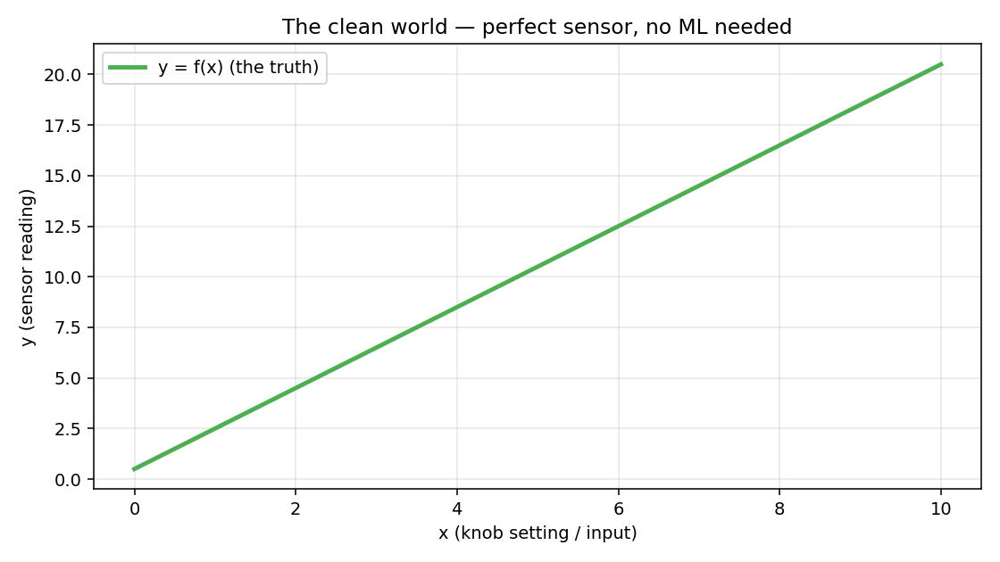
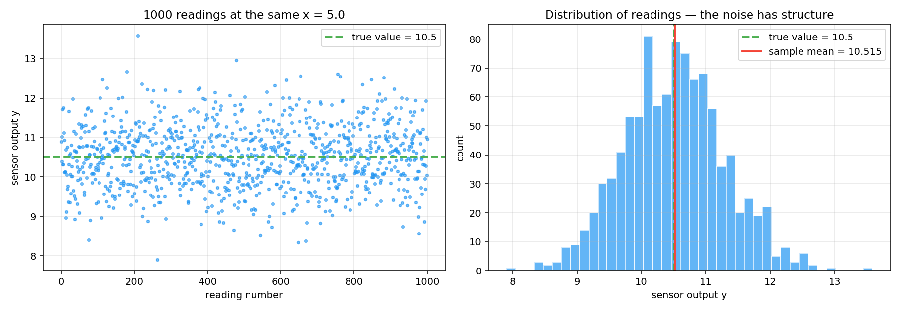
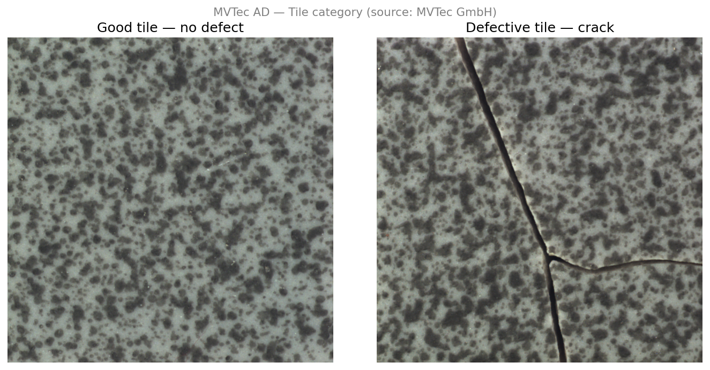
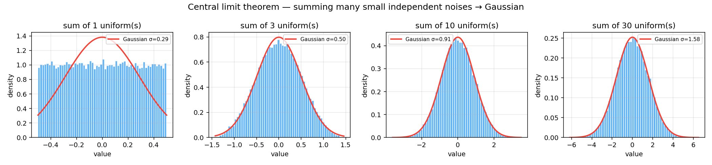
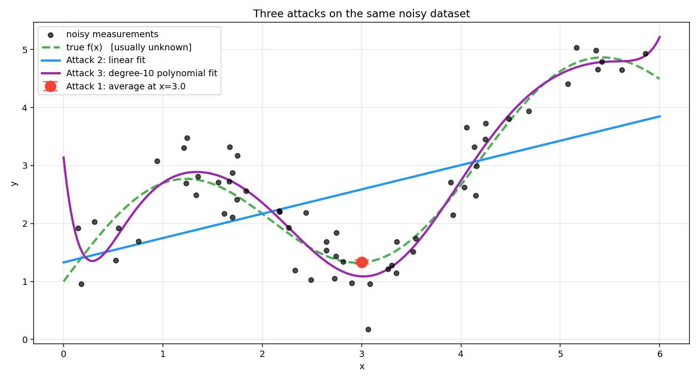

# 0 — From Measurements to Meaning

## Why This Book Exists

This book is about one problem, stated many ways:

- How do we recover the true value of something when our measurements of
  it are noisy?
- How do we extract *meaning* from raw sensor readings?
- How do we turn a grid of pixels into a decision: *what is this?*
- How do we train a model that generalizes from examples it has seen to
  data it hasn't?

These are all the same problem. It is called the **inverse problem** — given
the effects (measurements), recover the causes (the underlying truth). It
is arguably the central problem of empirical science and engineering.

The three major approaches to attacking it — classical signal processing,
parametric model fitting, and flexible machine learning — define the
structure of this book. By the end, you will know when to reach for each,
and why modern computer vision and multimodal AI lean so hard on the
third.

---

## 1. The Clean World

Forget models for a moment. You are an engineer with a sensor.

- You have a **source** — some thing in the world with a value you want to
  measure. A temperature. A distance. A concentration. A pixel intensity
  at a particular location on a scene.
- You point a **sensor** at it and read out a number — the **measurement**.
- If the sensor were perfect, the measurement would equal the true value
  exactly.

Formally: we have an input $x$ (what we control, or what identifies the
source) and a measurement $y$ we read off the sensor. There is some
relationship

$$
y = f(x)
$$

where $f$ is whatever the underlying physics dictates — linear,
exponential, wavy, arbitrary.

Two examples to fix the idea:

| | $x$ (source) | $f$ | $y$ (measurement) |
|---|---|---|---|
| Thermometer | True room temperature | Linear scaling (sensor response) | Reading on the display |
| Camera pixel | Light hitting the surface (scene radiance) | Lens + sensor transfer function | Gray-level pixel value |

In both cases, a perfect sensor would give you $f(x)$ exactly — no
guesswork, no error. The thermometer would read the true temperature;
the pixel would perfectly encode the true brightness.

**In a perfect world, machine learning wouldn't exist.** If you knew $f$,
you'd just plug in $x$ and read off $y$. No learning, no estimation, no
uncertainty. The entire ML and signal-processing industry hinges on
everything that comes next.

```python
import numpy as np
import matplotlib.pyplot as plt

x_grid = np.linspace(0, 10, 200)
true_f = lambda x: 2.0 * x + 0.5      # perfect linear sensor
y_clean = true_f(x_grid)

fig, ax = plt.subplots(figsize=(8, 4.5))
ax.plot(x_grid, y_clean, linewidth=2.5, label='y = f(x) (the truth)')
ax.set_xlabel('x (input / knob setting)')
ax.set_ylabel('y (sensor reading)')
ax.set_title('The clean world — perfect sensor, no ML needed')
ax.legend()
```



---

## 2. Noise Enters

Real sensors don't give you $f(x)$. They give you
$f(x) + \text{garbage}$. The garbage has physical origins:

- **Thermal noise** — electrons jiggling due to temperature; reducible by
  cooling but never fully eliminable.
- **Shot noise** — photons and electrons arrive at random discrete times,
  not as a smooth continuous stream; present in every semiconductor device
  (photodiode, CMOS pixel, transistor) regardless of temperature.
- **Quantization** — the ADC rounds to the nearest integer count.
- **Calibration drift** — the sensor baseline changes over hours or days.
- **Stray light / EM interference** — unintended signals leaking in.
- **Mechanical vibration** — the source or the sensor moved slightly
  between readings.

You cannot predict the garbage on any particular reading. What you *can*
predict is its **statistics** — its distribution, its mean (often 0), its
variance.

### Running the same measurement many times

Hold $x$ fixed. Read the sensor 1000 times. In the clean world the
readings would all be identical. In reality they scatter:

```python
x_fixed   = 5.0
true_value = true_f(x_fixed)   # = 10.5
noise_std  = 0.8
num_reads  = 1000

# Each reading = true value + independent Gaussian noise
readings = true_value + np.random.randn(num_reads) * noise_std

print(f"True value : {true_value}")
print(f"Sample mean: {readings.mean():.4f}")   # close to true_value
print(f"Sample std : {readings.std():.4f}")    # close to noise_std

fig, axes = plt.subplots(1, 2, figsize=(13, 4.5))

# Left: scatter of readings over time
axes[0].scatter(range(num_reads), readings, s=8, alpha=0.6)
axes[0].axhline(true_value, linestyle='--', label=f'true value = {true_value}')
axes[0].set_xlabel('reading number')
axes[0].set_ylabel('sensor output y')

# Right: histogram — noise has structure (bell shape)
axes[1].hist(readings, bins=40, alpha=0.7, edgecolor='white')
axes[1].axvline(true_value, linestyle='--', label='true value')
axes[1].axvline(readings.mean(), label=f'sample mean = {readings.mean():.3f}')
axes[1].set_xlabel('sensor output y')
axes[1].set_ylabel('count')
```



Two observations that matter for everything that follows:

1. **Single readings are almost useless.** No individual reading equals
   the truth. The best we can say is *"probably within the typical spread
   of the truth."*
2. **The readings aren't random in a lawless way.** They cluster — the
   distribution has a **shape**, a mean, a spread, symmetry. Noise is
   unpredictable at the level of one sample but predictable at the
   level of many.

That second point is the foundation of everything. We can't beat noise on
a single reading, but we can *characterize* it well enough to design
algorithms that work on average. The mathematical name for this is
**statistics**.

> **Running example — MVTec AD, Tile category**
>
> We will use one concrete dataset throughout this book to keep the
> abstractions grounded.
>
> The **MVTec Anomaly Detection (MVTec AD)** dataset is a public
> industrial surface inspection benchmark from MVTec GmbH. We use the
> **Tile category** — grayscale images of ceramic tile surfaces captured
> under controlled overhead lighting by a monochrome camera. Some images
> contain defects (cracks, glue strips, discolorations, rough patches);
> most do not. The task: decide whether a surface patch is defective.
>
> | Abstract | Concrete (MVTec Tile) |
> |----------|----------|
> | Source $x$ | a surface patch at a fixed location |
> | True value $f(x)$ | true surface reflectance at that patch |
> | Measurement $y$ | gray-level pixel value recorded by the camera |
> | Noise $\epsilon$ | sensor thermal noise, shot noise, stray light |
>
> This one dataset will be attacked three ways across the book:
> - **Attack 1** — average and filter images to suppress noise and reveal defect structure
> - **Attack 2** — fit a parametric texture model; flag patches that deviate from the fitted surface
> - **Attack 3** — train a CNN on labeled defect/no-defect patches
>
> In a perfect sensor, the pixel values would encode true reflectance
> exactly and defects would be trivially visible. In practice, noise and
> texture variation make this hard — and that difficulty is exactly what
> drives everything that follows.
>
> 

---

## 3. Why Is the Noise Gaussian?

Look at the histogram in Section 2. That bell shape isn't coincidence. In
physics and engineering, measurement noise is **overwhelmingly Gaussian**,
and there is a deep reason: the **Central Limit Theorem (CLT)**.

The CLT says: if you add up many independent small random contributions,
each from some distribution (any distribution, as long as each has a
finite variance), the **sum** tends to be Gaussian-distributed —
regardless of the individual distributions.

Your sensor's noise is the sum of many tiny independent contributions:
thermal, quantization, vibration, EM. By the CLT, their aggregate is
approximately Gaussian. **This is physics, not a mathematical
convenience.**

```python
num_draws = 50_000
K_values  = [1, 3, 10, 30]   # number of uniforms to sum

fig, axes = plt.subplots(1, 4, figsize=(15, 3.5))

for ax, K in zip(axes, K_values):
    # Sum K independent uniform(-0.5, 0.5) samples
    samples = np.random.uniform(-0.5, 0.5, size=(num_draws, K))
    sums    = samples.sum(axis=1)

    ax.hist(sums, bins=60, density=True, alpha=0.7, edgecolor='white')

    # Overlay matched Gaussian: variance of uniform(-0.5,0.5) = 1/12
    sigma   = np.sqrt(K / 12.0)
    x_plot  = np.linspace(sums.min(), sums.max(), 200)
    gauss   = np.exp(-x_plot**2 / (2 * sigma**2)) / (sigma * np.sqrt(2 * np.pi))
    ax.plot(x_plot, gauss, linewidth=2, label=f'Gaussian σ={sigma:.2f}')

    ax.set_title(f'sum of {K} uniform(s)')
    ax.set_xlabel('value')
    ax.set_ylabel('density')
    ax.legend(fontsize=8)
```



> **Part I detour:** the full probability toolkit that makes this
> statement precise — Bernoulli → Binomial → Poisson → Normal → CLT — is
> built in [Part I of this book](../../math/probability/README.md). If
> your probability is rusty or if you want the derivations, read that
> first. If you trust the intuition above for now, continue.

The practical payoff arrives in Chapter 7 (Part IV), where we build on
this intuition to derive least-squares fitting as maximum likelihood
under Gaussian noise — a rigorous justification for why so many
algorithms in CV and ML use squared-error losses.

---

## 4. The Inverse Problem — Three Attacks

Now we can state the general problem clearly.

> **Given** noisy measurements $y_i = f(x_i) + \epsilon_i$, where
> $\epsilon_i$ is random with approximately known statistics.
> **Goal:** recover something useful about $f$ — specific values, the full
> function, or predictions at new inputs.

Three attacks exist. Each makes a different assumption about how much you
already know about $f$ before you start.

### Attack 1 — Averaging and signal processing

**Premise:** I can repeat the measurement at the same $x$ as many times
as I want.

Take $N$ readings at a single $x$. Their average $\bar{y}$ has expected
value $f(x)$ (the noise averages out) and standard deviation
$\sigma / \sqrt{N}$. Double the readings → noise drops by $\sqrt{2}$.
This is the famous **$\sqrt{N}$ rule** — it is the whole reason that
scientific instruments have "integration time" knobs.

Classical signal processing generalizes averaging — low-pass filtering,
Wiener filtering, Kalman filtering — all are sophisticated forms of
"combine many noisy observations to reduce uncertainty."

- **Buys you:** excellent estimates at the specific $x$ values you
  measured.
- **Doesn't buy you:** any predictions for *new* $x$ values.

Two flavours of averaging matter in practice:

| | Ensemble average | Signal average (moving average) |
|---|---|---|
| What you average | Many repeated trials at the same point | Neighbouring values across position or time |
| Assumption | Each trial has independent noise | Signal is locally smooth within the window |
| Practical limit | Need many repetitions of the same measurement | Blurs sharp edges and fine detail |
| Imaging example | Average 100 frames of the same scene | Slide a window across one frame, average pixels inside it |

In a lab you can often do ensemble averaging — hold everything still and
repeat. In production imaging you rarely can (scene changes, one frame
available), so **signal averaging** (spatial smoothing, Gaussian blur,
moving average filter) is the practical tool. Wider window → more noise
reduction but more blurring of real defect edges. Part II covers both
in detail.

> **MVTec example:** average multiple exposures of the same tile patch
> to suppress sensor noise, then apply a smoothing filter to separate
> the slow-varying background texture from sharp defect edges. This
> reduces noise and makes defect structure more visible — but only tells
> us about patches we have already imaged. It gives no prediction for
> unseen surfaces.

Parts II and III of this book develop this attack for the imaging case:
sampling, sensors, pixels, contrast, and why raw-pixel operations run
into fundamental limitations.

### Attack 2 — Parametric fitting (known model form)

**Premise:** I already know the functional form of $f$ from physics or
from prior knowledge. I just don't know a handful of constants.

Examples:

- Radioactive decay: $y(t) = A e^{-\lambda t}$ — two unknowns $A, \lambda$.
- Sensor calibration: $y = \alpha x + \beta$ — slope and offset.
- Ideal gas: $PV = nRT$ — fit $n$ to data.

Pick the constants that make the model best match the data. The standard
criterion is **least-squares**: choose $\alpha$ and $\beta$ to minimise
the total squared gap between each measurement $y_i$ and the model's
prediction $\alpha x_i + \beta$:

$$\min_{\alpha,\, \beta} \sum_{i=1}^{N} \bigl(y_i - \alpha x_i - \beta\bigr)^2$$

Intuitively: draw all possible lines through the scatter of points; the
least-squares line is the one where the sum of the squared vertical
distances from each point to the line is smallest. Squaring the gaps
means large errors are penalised more heavily than small ones — a point
twice as far from the line contributes four times the penalty. This is
both a strength and a weakness: the fit responds strongly to every
point, but a single outlier with a large gap pulls the line toward it
to reduce that squared penalty. Least-squares is not outlier-robust.

The values of $\alpha$ and $\beta$ that achieve this minimum can be
computed exactly from the data — no iteration needed. This is what
classical statistics calls **regression**. You're not discovering what
$f$ looks like; you're nailing down a few numbers inside a form that
was handed to you by domain knowledge. The full derivation — why
squaring, why this specific formula, and its connection to maximum
likelihood under Gaussian noise — arrives in Chapter 7.

- **Buys you:** predictions at any $x$, not just the measured ones.
- **Costs:** if the assumed form is wrong, your predictions are wrong no
  matter how much data you collect.

> **MVTec example:** the MVTec tile surfaces are flat and the lighting is
> fixed, so Lambert's cosine law simplifies to $y = \alpha \cdot r + \beta$
> — a linear relationship between true reflectance $r$ and pixel value $y$.
> Fit $\alpha$ (lamp gain) and $\beta$ (dark current) from a set of
> defect-free calibration patches using least-squares. Any patch whose
> pixel values deviate significantly from this fitted model is flagged as
> a defect. The model generalises across the whole surface — but only
> because the flat-surface, fixed-lighting assumption holds. Change the
> lamp angle or surface curvature and the calibration breaks.

### Attack 3 — Flexible learning (machine learning)

**Premise:** I don't know the form of $f$. But I have many $(x, y)$ pairs
and I'm willing to spend compute.

Pick a flexible **hypothesis class** — polynomials, kernels, neural
networks, transformers — and find the member that best matches the data.
You're not committing to a specific form, just a space of forms. The
algorithm chooses the form from the space.

- **Buys you:** the ability to handle problems where no physical model
  exists — image classification, language, complex real-world mappings.
- **Costs:** much more data, careful handling of overfitting, harder
  interpretation of the resulting model.

> **MVTec example:** the Tile category contains five defect types —
> cracks, glue strips, gray strokes, oil spots, and rough patches — each
> with a different visual signature. No single parametric model covers
> all of them. Instead, train a CNN on the labeled MVTec patches: the
> network learns which combinations of local texture, edge, and contrast
> cues predict *defective* — without anyone specifying those cues
> explicitly. Attack 3 wins here because the variety of defect
> appearances is too complex to write down as a formula, but the
> patterns are learnable from data.

Parts V (CNNs) and VI (attention, vision transformers, multimodal models)
of this book develop Attack 3. They are, structurally, elaborate
parametric-fitting problems — but with hypothesis classes flexible
enough to learn the form of $f$ rather than inherit it.

---

## 5. Three Attacks on the Same Data

To make the three attacks tangible, consider a simple simulation. We
invent a true underlying function:

$$f(x) = 1 + 0.5x + 1.2\sin(1.5x)$$

This is a mildly wavy curve — not a straight line, not wildly
complicated. Think of it as the true reflectance profile of a surface as
you slide a sensor across it. We then simulate 60 noisy measurements
by sampling $x$ values uniformly between 0 and 6, computing the true
$f(x)$ at each, and adding Gaussian noise:

$$y_i = f(x_i) + \epsilon_i, \quad \epsilon_i \sim \mathcal{N}(0,\ 0.4^2)$$

In a real experiment $f$ would be unknown. Here we keep it visible
(dashed green line) so you can see how well each attack recovers it.



What the figure shows:

- **Attack 1 (red dot)** — we pretend we can re-measure at $x = 3$
  many times and average those readings. The estimate lands very close
  to the true value at that one point, with a small error bar. But the
  rest of the curve is completely unknown to us — we have no way to
  predict $f$ at any other $x$.
- **Attack 2 (blue line)** — we fit a straight line through all 60
  measurements. It predicts everywhere but misses the wiggle entirely.
  The assumed form (linear) is wrong, and no amount of extra data
  fixes a wrong assumption.
- **Attack 3 (purple curve)** — we fit a degree-10 polynomial, which is
  flexible enough to track the wiggle. It follows the true curve
  closely in the middle, though it starts to stray at the edges where
  data is sparse. With even less data or a higher degree polynomial it
  would start fitting the noise bumps rather than the true signal —
  the failure mode called **overfitting**.

**No attack is universally right.** The skill is matching the attack to
what you already know about your problem. In practice you often combine
them — average noisy readings first (Attack 1), fit a calibration curve
to the averages (Attack 2), then pass the calibrated data to a neural
network (Attack 3).

The mathematics behind each attack is built up across the book — why
averaging reduces error in Attack 1 (Part I, probability), how the
slope is derived from data in Attack 2 (Chapter 7, maximum likelihood),
and how overfitting is detected and controlled in Attack 3 (Chapter 12,
training). Each concept is introduced only when the tools to explain it
properly are in place.

---

## 6. From 1D Signals to Images to Multimodal AI

Everything above used a scalar input $x$. Real problems are almost
always higher-dimensional:

- **A pixel in an image** — input is a 2D spatial coordinate, output is
  the intensity at that coordinate.
- **A full image** — input *is* the image (a high-dimensional vector of
  pixels), output is a classification or a latent feature.
- **Video** — input is an image indexed by time; noise and signal both
  have temporal structure.
- **Audio** — input is a 1D signal over time; same framework, different
  dimensionality.
- **Multimodal** — an input might contain an image *and* text *and*
  audio simultaneously; each modality is a different signal, and the
  task is to fuse them.

The mathematics scale cleanly: wherever we wrote $y = f(x) + \epsilon$ for
scalar $x$, we can write $y = f(\mathbf{x}) + \epsilon$ for vector
$\mathbf{x}$, or $\mathbf{y} = f(\mathbf{x}) + \boldsymbol{\epsilon}$ for
vector output. The three attacks stay the same. Visualization gets
harder, the amount of data needed grows (the **curse of dimensionality**),
and the algorithms become heavier — but the problem statement doesn't
change.

This is why the book's title is **Signals to Transformers** and not
*Pixels to Transformers*: the framework subsumes pixels, tokens, audio,
and video alike. A transformer processing a paragraph, a ViT processing
an image, and a CLIP model fusing images with captions are all solving
the same inverse problem — they just work in different signal spaces.

---

## 7. How to Read This Book

You don't have to read linearly. Three paths are supported:

### Path A — Top-to-bottom, math first
If you want the mathematical foundations laid in properly before any
applied content, read **Part I (Math Foundations)** in full, then Parts
II–VI in order.

Good if: you've worked in engineering adjacent to CV but the probability
/ linear algebra is rusty.

### Path B — Applied first, math as needed
Start with **Part II (Signals and Measurement)**, work through the rest
in order, and use Part I as a reference when the math gets too thin.

Good if: you already know undergrad probability and linear algebra and
want to get to CV fast.

### Path C — Target a specific chapter
Every chapter lists its prerequisites up front. Jump to whatever you need
(e.g. Chapter 13 on self-attention if that's why you're here) and
backtrack to prerequisite chapters as needed.

Good if: you have a specific goal in mind and your foundations are already
solid.

### Reading checkpoints — the four big "aha" moments

If you only get these four, the book has done its job:

1. **Why squared-error is special** — it's the maximum-likelihood estimator
   under Gaussian noise (Chapter 7).
2. **Why linear algebra underlies every vision operation** — image
   comparison, matching, features, and attention all reduce to dot
   products and projections (Chapter 8).
3. **Why convolutions work for images** — weight sharing over a
   translation-invariant domain (Chapter 9).
4. **Why attention works for everything else** — dynamic, data-dependent
   aggregation without baked-in geometry (Chapter 13).

---

## Summary

| Concept | Key idea |
|---------|----------|
| Measurement | $y = f(x) + \epsilon$ — signal plus noise |
| Noise | Physical, statistical, typically Gaussian (CLT) |
| Inverse problem | Recover $f$ from $(x, y)$ pairs |
| Attack 1 | Average / filter at known $x$ values (signal processing) |
| Attack 2 | Fit parameters inside a known functional form (regression) |
| Attack 3 | Pick a flexible hypothesis class, let data choose the form (ML) |
| Signals | Pixels, tokens, audio, video — the same math covers all |
| Running example | MVTec AD Tile: filter/average (A1), fit Lambert calibration model (A2), train CNN on labeled patches (A3) |

---

**Next →** [Part I — Math Foundations](../../math/probability/README.md)
if you want the probability and linear algebra before the applied content,
or skip to [Part II — Signals and Measurement](../part2_signals_and_measurement/ch01_digitisation/)
for the first applied chapter.
