# Chapter 1 — Digitisation
### Sampling, Nyquist, and Aliasing

> *Before you can understand what a pixel is, you need to understand the act that creates it: sampling. This chapter builds that foundation from first principles — starting with a 1D wave and ending with the moiré patterns you see in photographs of fine fabric.*

---

## 1.1 The Problem: The World Is Continuous, Sensors Are Not

A scene in front of a camera emits or reflects light continuously — there is a brightness value at every real-valued point $(x, y)$ in space. A sensor cannot capture this. It can only measure brightness at a **finite grid of locations**. The act of choosing those locations, and measuring only there, is called **sampling**.

The same idea applies in time: a microphone samples air pressure at discrete moments. A camera samples scene brightness at discrete spatial positions. In both cases, the continuous world is approximated by a finite sequence of numbers.

**The central question of this chapter:** how many samples do you need, and what goes wrong if you take too few?

---

## 1.2 Sampling a 1D Signal

Start with the simplest possible case: a cosine wave at frequency $f_m$ Hz.

$$x(t) = \cos(2\pi f_m t)$$

Sampling at rate $f_s$ means measuring this at $t = 0,\; 1/f_s,\; 2/f_s,\; \ldots$:

$$x[n] = \cos\!\left(\frac{2\pi f_m n}{f_s}\right), \quad n = 0, 1, 2, \ldots$$

The gap between consecutive samples is the **sampling interval** $\Delta t = 1/f_s$.

**Three regimes to build intuition:**

| Sampling rate $f_s$ | Samples per cycle of $x(t)$ | Result |
|--------------------|-----------------------------|--------|
| $f_s = 30$ Hz, $f_m = 3$ Hz | 10 per cycle | Dense — wave shape clearly traced |
| $f_s = 8$ Hz, $f_m = 3$ Hz | ~2.7 per cycle | Sparse — shape just about captured |
| $f_s = 5$ Hz, $f_m = 3$ Hz | 1.7 per cycle | Below limit — reconstruction is wrong |

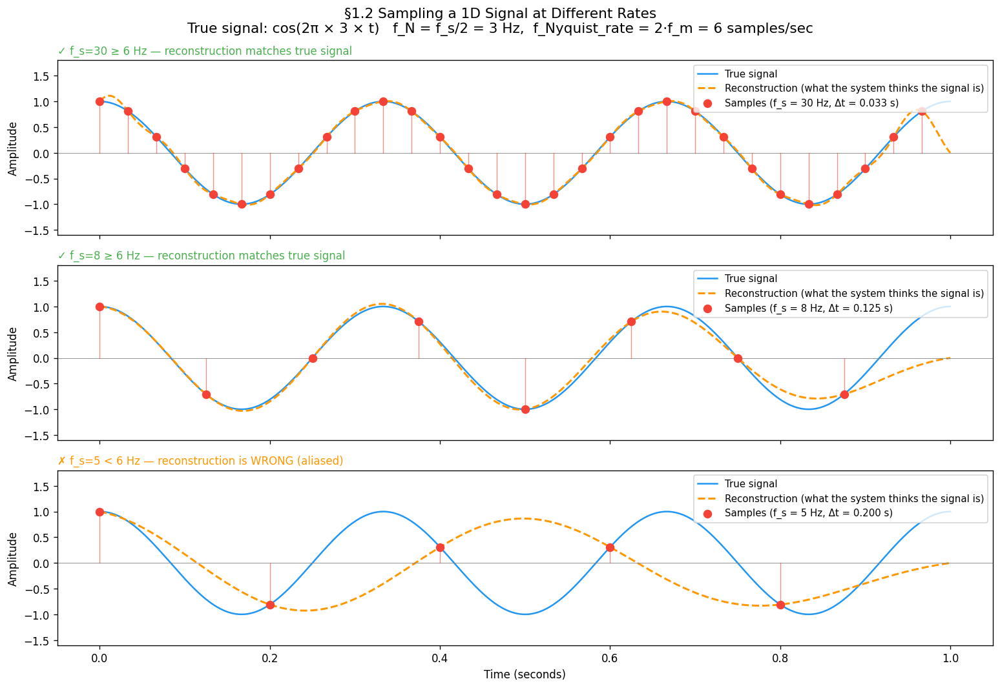

```python
import numpy as np
import matplotlib.pyplot as plt

f_m = 3.0                                     # Hz — signal frequency
t_dense = np.linspace(0, 1, 2000)            # "continuous" reference
continuous_signal = np.cos(2 * np.pi * f_m * t_dense)

sampling_rates = [30, 8, 5]                   # samples/second — dense, sparse, below Nyquist

fig, axes = plt.subplots(3, 1, figsize=(13, 9), sharex=True)
for ax, fs in zip(axes, sampling_rates):
    t_samples = np.arange(0, 1, 1.0 / fs)
    samples   = np.cos(2 * np.pi * f_m * t_samples)

    ax.plot(t_dense, continuous_signal, lw=1.5, label='Continuous signal')
    for ts, sv in zip(t_samples, samples):
        ax.plot([ts, ts], [0, sv], lw=0.8, alpha=0.6)   # stems
    ax.scatter(t_samples, samples, s=50,
               label=f'Samples (f_s={fs} Hz, Δt={1/fs:.3f} s)')

    status = '✓ OK' if fs >= 2 * f_m else '✗ ALIASING'
    ax.set_title(f'f_s={fs} Hz — {status}', fontsize=10, loc='left')
    ax.set_ylabel('Amplitude')
    ax.legend(loc='upper right', fontsize=9)

axes[-1].set_xlabel('Time (seconds)')
plt.tight_layout()
plt.show()
```

---

## 1.3 Reconstruction — Putting the Signal Back Together

Sampling gives us a finite set of dots. **Reconstruction** is the reverse: given only those dots, recover a continuous signal. The standard method is **Whittaker–Shannon sinc interpolation**:

$$x(t) = \sum_{n=-\infty}^{\infty} x[n] \cdot \text{sinc}\!\left(f_s \cdot (t - n/f_s)\right)$$

where $\text{sinc}(u) = \sin(\pi u) / (\pi u)$.

Each sample $x[n]$ contributes a sinc "bump" centred at its sample time $n/f_s$. The bumps are designed to be exactly 1 at their own sample and 0 at every other sample — so they tile together without interfering. When you add them all up you get back a smooth continuous curve.

**Why sinc?** It is the ideal low-pass filter in the frequency domain — it passes all frequencies below $f_N = f_s/2$ unchanged and completely blocks everything above. This is exactly the property needed to invert sampling.

### How the sinc kernel works

The key property of sinc is:

$$\text{sinc}(0) = 1 \qquad \text{sinc}(n) = 0 \;\text{ for all non-zero integers } n$$

This means each shifted kernel $x[n] \cdot \text{sinc}(f_s(t - n/f_s))$ is:
- Equal to $x[n]$ at its own sample time $t = n/f_s$
- Exactly **zero** at every other sample time

So the kernels tile together without interfering — each sample "owns" its position and contributes nothing to its neighbours. The sum passes exactly through every sample point and interpolates smoothly between them.

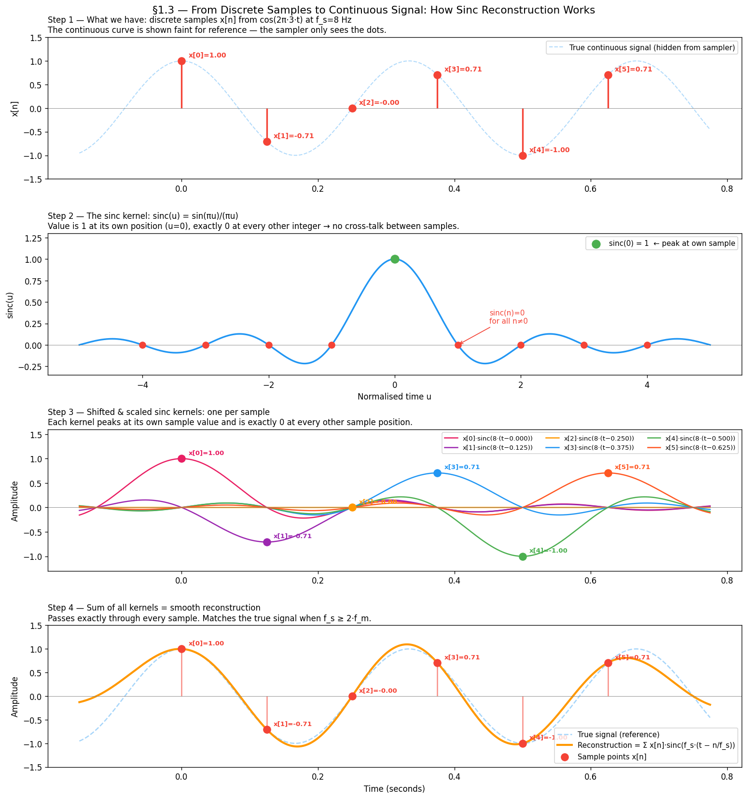

```python
import numpy as np
import matplotlib.pyplot as plt

f_m           = 3.0
fs_sinc_demo  = 8.0

# 6 real samples from cos(2π·f_m·t) at f_s=8 Hz — same signal as §1.2
sample_times  = np.arange(0, 6.0 / fs_sinc_demo, 1.0 / fs_sinc_demo)
sample_values = np.cos(2 * np.pi * f_m * sample_times)

t_display = np.linspace(-0.15, sample_times[-1] + 0.15, 3000)
t_cont    = t_display.copy()
true_cont = np.cos(2 * np.pi * f_m * t_cont)

# sinc function for panel 2 — shown in normalised time units
t_sinc_norm = np.linspace(-5, 5, 2000)
sinc_vals   = np.sinc(t_sinc_norm)   # np.sinc(x) = sin(πx)/(πx)

# One shifted, scaled kernel per sample
palette = ['#E91E63', '#9C27B0', '#FF9800', '#2196F3', '#4CAF50', '#FF5722']
colors_kernels = [palette[i % len(palette)] for i in range(len(sample_times))]

kernels        = []
reconstruction = np.zeros_like(t_display)
for tn, sn in zip(sample_times, sample_values):
    k = sn * np.sinc(fs_sinc_demo * (t_display - tn))
    kernels.append(k)
    reconstruction += k

fig, axes = plt.subplots(4, 1, figsize=(13, 14))

# Panel 1 — Stem plot: the discrete samples with true signal faint in background
axes[0].plot(t_cont, true_cont, lw=1.2, alpha=0.35, linestyle='--')
axes[0].vlines(sample_times, 0, sample_values, lw=2)
axes[0].scatter(sample_times, sample_values, s=80, zorder=5)
for i, (tn, sn) in enumerate(zip(sample_times, sample_values)):
    axes[0].annotate(f'x[{i}]={sn:.2f}', xy=(tn, sn), xytext=(tn+0.01, sn+0.08), fontsize=8.5)

# Panel 2 — The sinc function with sinc(0)=1 and zeros at integers marked
axes[1].plot(t_sinc_norm, sinc_vals, lw=2)
axes[1].scatter([0], [1], s=100, zorder=5, label='sinc(0)=1')
for n in [-4, -3, -2, -1, 1, 2, 3, 4]:
    axes[1].scatter([n], [0], s=60, zorder=5)

# Panel 3 — Shifted scaled kernels, one per sample in a different colour
for i, (tn, sn, k) in enumerate(zip(sample_times, sample_values, kernels)):
    axes[2].plot(t_display, k, lw=1.5, color=colors_kernels[i],
                 label=f'x[{i}]·sinc(8·(t−{tn:.3f}))')
    axes[2].scatter([tn], [sn], color=colors_kernels[i], s=80, zorder=5)
    axes[2].annotate(f'x[{i}]={sn:.2f}', xy=(tn, sn), xytext=(tn+0.01, sn+0.09), fontsize=8)

# Panel 4 — Sum of all kernels = reconstruction, overlaid on true signal
axes[3].plot(t_cont, true_cont, lw=1.5, alpha=0.4, linestyle='--', label='True signal')
axes[3].plot(t_display, reconstruction, lw=2.5,
             label='Reconstruction = Σ x[n]·sinc(f_s·(t − n/f_s))')
axes[3].vlines(sample_times, 0, sample_values, lw=1.5, alpha=0.6)
axes[3].scatter(sample_times, sample_values, s=80, zorder=5, label='Samples x[n]')

plt.tight_layout()
plt.show()
```

### The truncation problem

The formula sums from $-\infty$ to $+\infty$ — it needs samples from the entire real line. In practice we have a finite window. Cutting off the sinc tails causes **edge artefacts**: the reconstruction wiggles near the start and end of the window even when the sampling rate is perfectly adequate.

**The fix used throughout this chapter:** sample a long window (5 seconds), then evaluate reconstruction quality only in the central 1-second region. The edges are discarded. This is why the MSE curves in §1.4 are smooth rather than jagged.

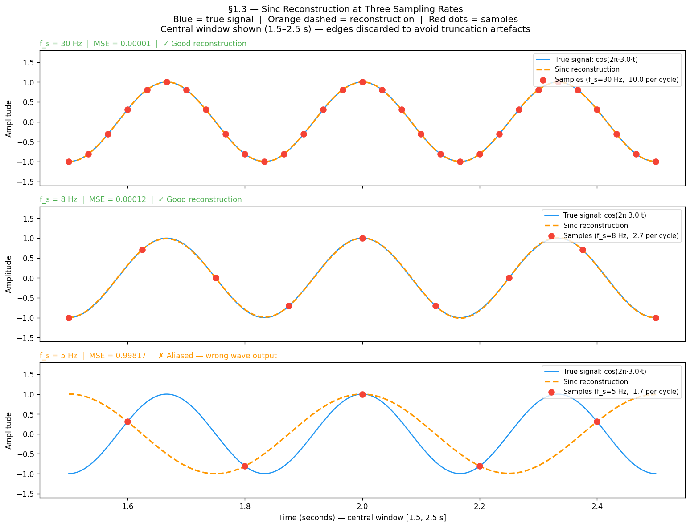

```python
import numpy as np
import matplotlib.pyplot as plt

f_m      = 3.0          # Hz — signal frequency
T_LONG   = 5.0          # long window to give sinc tails enough support
T_SHOW   = (1.5, 2.5)   # display only the central region — edges discarded

t_long  = np.linspace(0, T_LONG, 20000)
t_show  = np.linspace(T_SHOW[0], T_SHOW[1], 3000)
true_show = np.cos(2 * np.pi * f_m * t_show)

fig, axes = plt.subplots(3, 1, figsize=(13, 10), sharex=True)
fig.suptitle('§1.3 Sinc Reconstruction at Three Sampling Rates\n'
             'Orange dashed = reconstruction  |  Blue = true signal  |  Red dots = samples',
             fontsize=12)

for ax, fs in zip(axes, [30, 8, 5]):
    t_s = np.arange(0, T_LONG, 1.0 / fs)
    s_s = np.cos(2 * np.pi * f_m * t_s)

    # Sinc reconstruction — sum over ALL samples in the long window
    recon = sum(sn * np.sinc(fs * (t_show - tn)) for tn, sn in zip(t_s, s_s))

    # Samples that fall in the display window
    mask = (t_s >= T_SHOW[0]) & (t_s <= T_SHOW[1])

    ax.plot(t_show, true_show, lw=1.5, label=f'True signal: cos(2π·{f_m}·t)')
    ax.plot(t_show, recon, lw=2, linestyle='--',
            label='Sinc reconstruction')
    ax.scatter(t_s[mask], s_s[mask], s=60, zorder=5,
               label=f'Samples (f_s={fs} Hz)')

    mse = np.mean((true_show - recon) ** 2)
    status = '✓ Good reconstruction' if fs >= 2 * f_m else '✗ Wrong — aliased reconstruction'
    ax.set_title(f'f_s = {fs} Hz  |  MSE = {mse:.4f}  |  {status}', fontsize=10, loc='left')
    ax.set_ylabel('Amplitude')
    ax.legend(loc='upper right', fontsize=9)
    ax.axhline(0, color='gray', lw=0.5)
    ax.set_ylim(-1.6, 1.8)

axes[-1].set_xlabel('Time (seconds) — central window shown, edges discarded')
plt.tight_layout()
plt.show()
```

**What to observe:**
- At $f_s = 30$ Hz: reconstruction (dashed) overlaps the true signal almost perfectly — MSE ≈ 0
- At $f_s = 8$ Hz: reconstruction still tracks the true signal — just above the Nyquist rate
- At $f_s = 5$ Hz: reconstruction outputs the **wrong wave** entirely — this is aliasing

This raises the key question: *what is the minimum $f_s$ that guarantees correct reconstruction?*

---

## 1.4 The Nyquist Criterion

The minimum sampling rate for faithful reconstruction has an exact answer:

$$\boxed{f_s \geq 2 f_m}$$

This is the **Nyquist–Shannon sampling theorem**. The minimum rate $2f_m$ is called the **Nyquist rate**. Half the sampling rate, $f_N = f_s/2$, is called the **Nyquist frequency** — the highest frequency your chosen $f_s$ can represent.

**Why the factor of 2?** To capture a cosine you must observe at least one peak and one trough per cycle. That takes a minimum of two samples per period. One sample per cycle is not enough — you cannot distinguish a peak from a trough.

### Notation used throughout this book

| Symbol | Meaning |
|--------|---------|
| $f_m$ | Maximum frequency present in the signal |
| $f_s$ | Sampling rate (samples/second or samples/pixel) |
| $f_N = f_s / 2$ | Nyquist frequency — the ceiling imposed by your $f_s$ |
| $2 f_m$ | Nyquist rate — the minimum $f_s$ you need |

The no-aliasing condition: $f_N \geq f_m$, equivalently $f_s \geq 2f_m$.

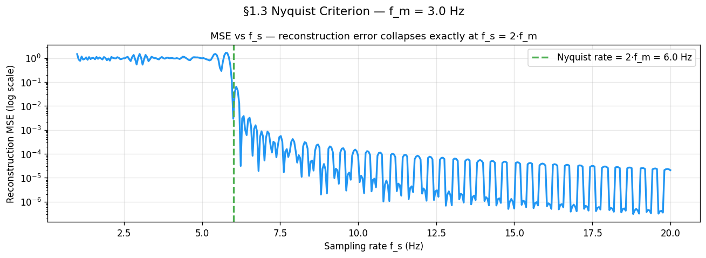

```python
f_m = 3.0
sweep_rates = np.linspace(1.0, 20.0, 400)

# 5-second window so sinc tails have enough support.
# MSE evaluated only in central window (2–3 s) to avoid edge artefacts.
T_LONG    = 5.0
t_eval    = np.linspace(2.0, 3.0, 5000)
true_eval = np.cos(2 * np.pi * f_m * t_eval)

errors = []
for fs in sweep_rates:
    t_s   = np.arange(0, T_LONG, 1.0 / fs)
    s_s   = np.cos(2 * np.pi * f_m * t_s)
    recon = sum(sn * np.sinc(fs * (t_eval - tn)) for tn, sn in zip(t_s, s_s))
    errors.append(np.mean((true_eval - recon) ** 2))

fig, ax = plt.subplots(figsize=(11, 4))
ax.semilogy(sweep_rates, np.array(errors) + 1e-10, lw=2)
ax.axvline(2 * f_m, linestyle='--', label=f'Nyquist rate = 2·f_m = {2*f_m} Hz')
ax.set_xlabel('Sampling rate f_s (Hz)')
ax.set_ylabel('Reconstruction MSE (log scale)')
ax.set_title('MSE vs f_s — reconstruction error collapses exactly at f_s = 2·f_m')
ax.legend(); ax.grid(True, alpha=0.3)
plt.show()
```

### Why does MSE oscillate above Nyquist?

Look at the MSE curve above Nyquist. It does not fall smoothly to zero — it ripples up and down as $f_s$ increases. This is **not noise or a simulation artefact**. It is a direct consequence of phase offset between the sampler and the signal.

For each $f_s$ the sample grid $n/f_s$ lands on a different phase of $\cos(2\pi f_m t)$. When samples fall near the **peaks and troughs** they carry maximum information and MSE is low. When they fall near the **zero-crossings** they carry almost none and MSE is high. As $f_s$ sweeps continuously this phase relationship cycles through all possibilities, producing the periodic ripple.

The figure below shows this directly: each row is a different $f_s$ above Nyquist. The left panel shows where samples land on the wave; the right panel marks that $f_s$ on the MSE ripple curve. You can see the MSE go up when samples cluster near zero-crossings and down when they hit peaks.

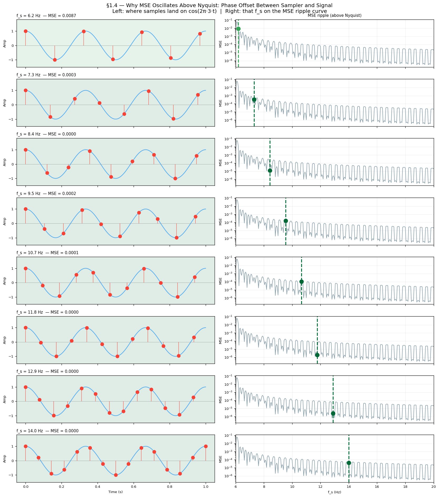

```python
f_m   = 3.0
T_LONG = 5.0
t_eval = np.linspace(2.0, 3.0, 5000)
true_eval = np.cos(2 * np.pi * f_m * t_eval)

demo_rates = np.linspace(6.2, 14.0, 8)   # 8 values, all above Nyquist (2·3=6 Hz)

fig, axes = plt.subplots(len(demo_rates), 2, figsize=(14, 16))

for row, fs_demo in enumerate(demo_rates):
    t_wave = np.linspace(0, 1.0, 3000)
    axes[row, 0].plot(t_wave, np.cos(2 * np.pi * f_m * t_wave), lw=1.5, alpha=0.7)

    # Sample the long window, display only first second
    t_s = np.arange(0, T_LONG, 1.0 / fs_demo)
    s_s = np.cos(2 * np.pi * f_m * t_s)
    t_s_show = t_s[t_s <= 1.0]
    s_s_show = s_s[:len(t_s_show)]
    axes[row, 0].scatter(t_s_show, s_s_show, s=55, zorder=5)
    axes[row, 0].vlines(t_s_show, 0, s_s_show, lw=1.2, alpha=0.6)

    # MSE for this f_s
    recon = sum(sn * np.sinc(fs_demo * (t_eval - tn)) for tn, sn in zip(t_s, s_s))
    mse = np.mean((true_eval - recon) ** 2)
    axes[row, 0].set_title(f'f_s={fs_demo:.1f} Hz  MSE={mse:.4f}', fontsize=9, loc='left')

    # Right panel: MSE ripple curve with this f_s marked
    axes[row, 1].semilogy(sweep_rates[sweep_rates >= 6], errors_above_nyq + 1e-10, lw=1.2)
    axes[row, 1].axvline(fs_demo, lw=2, linestyle='--')
    axes[row, 1].scatter([fs_demo], [mse + 1e-10], s=80, zorder=5)

plt.tight_layout()
plt.show()
```

**What to observe:**
- Rows where samples land near **±1 (peaks/troughs)** → green background, low MSE
- Rows where samples land near **0 (zero-crossings)** → red background, high MSE
- The right-panel ripple curve confirms the pattern: MSE dips each time samples hit peaks, rises each time they hit zero-crossings

This is the same phenomenon as §1.7 (Phase Offset) but shown continuously across all $f_s$ values, not just at the Nyquist boundary.

---

### What "sufficient" really means

The theorem says $f_s = 2f_m$ is sufficient — **in theory**. The figure below shows that at exactly the Nyquist rate, sinc reconstruction recovers the signal perfectly, but only if the sample grid is perfectly phase-aligned with the signal. In practice the sampler and signal have independent clocks. Section 1.6 shows what happens when they are not aligned.

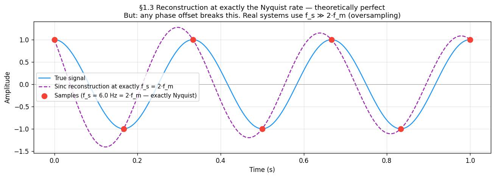

```python
fs_nyquist = 2.0 * f_m          # exactly at Nyquist
t_s  = np.arange(0, T_LONG, 1.0 / fs_nyquist)
s_s  = np.cos(2 * np.pi * f_m * t_s)

t_ref      = np.linspace(0, 1, 5000)
true_signal = np.cos(2 * np.pi * f_m * t_ref)

# Sinc reconstruction from the long sample set, evaluated on 0–1 s
recon = sum(sn * np.sinc(fs_nyquist * (t_ref - tn)) for tn, sn in zip(t_s, s_s))

fig, ax = plt.subplots(figsize=(11, 4))
ax.plot(t_ref, true_signal, lw=1.5, label='True signal')
ax.plot(t_ref, recon, lw=1.5, linestyle='--', label='Sinc reconstruction at f_s = 2·f_m')
ax.scatter(t_s[(t_s >= 0) & (t_s <= 1)],
           np.cos(2 * np.pi * f_m * t_s[(t_s >= 0) & (t_s <= 1)]),
           s=70, zorder=5, label=f'Samples (f_s = {fs_nyquist} Hz)')
ax.set_xlabel('Time (s)'); ax.set_ylabel('Amplitude')
ax.set_title('Reconstruction at exactly Nyquist — perfect when phase-aligned\n'
             'Real systems oversample (f_s ≫ 2·f_m) to make phase offset negligible')
ax.legend(fontsize=9); ax.grid(True, alpha=0.3)
plt.show()
```

---

## 1.5 Aliasing — High Frequencies Impersonating Low Ones

When $f_m > f_N$, something surprising happens: the samples from the high-frequency signal are **identical** to the samples of a lower-frequency signal. The sampler cannot tell them apart. The high frequency does not disappear — it *pretends to be* a lower frequency. This phantom is called an **alias**.

### Where does the alias formula come from?

Ask: which other frequencies $f'$ produce the exact same sample sequence as $f_m$?

The condition is:

$$\cos\!\left(\frac{2\pi f_m n}{f_s}\right) = \cos\!\left(\frac{2\pi f' n}{f_s}\right) \quad \text{for ALL integers } n$$

Cosine equality for all $n$ requires the arguments to differ by an integer multiple of $2\pi$:

$$\frac{2\pi f' n}{f_s} = \frac{2\pi f_m n}{f_s} + 2\pi k n \quad (k \in \mathbb{Z})$$

Divide by $2\pi n$, multiply by $f_s$:

$$\boxed{f' = f_m + k f_s}$$

This is the **complete solution set** — every integer $k$ gives one more alias. The set $\{f_m + kf_s \mid k \in \mathbb{Z}\}$ is called the **alias family** of $f_m$. All members produce identical discrete samples at rate $f_s$.

### Verification

Substitute $f' = f_m + kf_s$ and sample at $t = n/f_s$:

$$\cos\!\left(2\pi(f_m + kf_s)\cdot\frac{n}{f_s}\right)
= \cos\!\left(\frac{2\pi f_m n}{f_s} + \underbrace{2\pi kn}_{\text{integer multiple of } 2\pi}\right)
= \cos\!\left(\frac{2\pi f_m n}{f_s}\right)$$

The $f_s$ in $kf_s$ cancels with $1/f_s$ in the sample spacing, leaving $kn$ — always an integer — inside cosine, which is $2\pi$-periodic and ignores it. ∎

### Consequences

- Aliasing is **irreversible** — the samples carry no information about which alias family member they came from.
- The effect is not distortion — the signal is not degraded, it is *replaced* by a different signal entirely.
- Oversampling prevents it: if $f_N \gg f_m$, all alias family members with $k \neq 0$ are far above $f_N$ and cannot fold into the representable range.

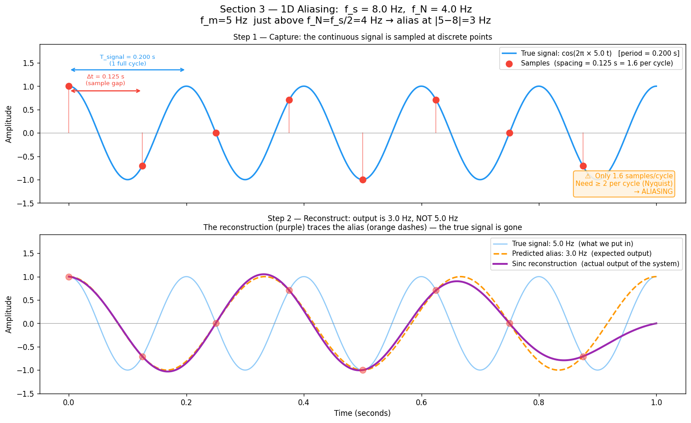

```python
fs_demo  = 8.0          # sampling rate
f_N      = fs_demo / 2  # Nyquist frequency = 4 Hz
f_m      = 5.0          # signal frequency — just above f_N
f_alias  = 3.0          # expected alias: |5 - 8| = 3 Hz
T_SHOW   = 1.0

t_long = np.linspace(0, T_SHOW, 2000)
t_s    = np.arange(0, T_SHOW, 1.0 / fs_demo)
s_true = np.cos(2 * np.pi * f_m * t_s)

# Sinc reconstruction — outputs alias when f_m > f_N
recon = sum(sn * np.sinc(fs_demo * (t_long - tn)) for tn, sn in zip(t_s, s_true))

fig, (ax_top, ax_bot) = plt.subplots(2, 1, figsize=(13, 8), sharex=True)

# Top: true signal + sample dots
ax_top.plot(t_long, np.cos(2 * np.pi * f_m * t_long), label=f'True signal: {f_m} Hz')
ax_top.scatter(t_s, s_true, s=70, zorder=5, label='Sample points')
ax_top.set_title('Step 1 — Capture: sample dots, only 1.6 per cycle (< 2 needed)')
ax_top.legend(); ax_top.set_ylabel('Amplitude')

# Bottom: reconstruction vs alias vs true
ax_bot.plot(t_long, np.cos(2 * np.pi * f_m * t_long), alpha=0.4, label=f'True: {f_m} Hz')
ax_bot.plot(t_long, np.cos(2 * np.pi * f_alias * t_long), '--', label=f'Alias: {f_alias} Hz')
ax_bot.plot(t_long, recon, lw=2.5, label='Sinc reconstruction (matches alias, not true!)')
ax_bot.set_title('Step 2 — Reconstruct: output is 3 Hz alias, not the 5 Hz input')
ax_bot.legend(); ax_bot.set_xlabel('Time (s)'); ax_bot.set_ylabel('Amplitude')

plt.tight_layout()
plt.show()
```

---

## 1.6 The Folding Diagram

All aliases collapse into $[0, f_N]$ by a simple two-step rule:

1. **Periodicity:** $f_{alias} = f_m \bmod f_s$ — reduce to $[0, f_s)$
2. **Mirror:** if $f_{alias} > f_N$, then $f_{alias} \leftarrow f_s - f_{alias}$ — reflect at $f_N$

This produces the triangular "folding" pattern:

```
Apparent frequency
    f_N |      /\      /\      /\
        |     /  \    /  \    /  \
        |    /    \  /    \  /    \
      0 |___/______\/______\/______\___
        0   f_N   f_s  3f_N  2f_s      True frequency
```

The spectrum bounces between 0 and $f_N$ with period $f_s$.

**Example** ($f_s = 8$ Hz, $f_N = 4$ Hz):

| True $f_m$ | Alias family member used | $f_{alias}$ | Note |
|-----------|--------------------------|-------------|------|
| 2 Hz | $k=0$ | **2 Hz** | Below $f_N$, no folding |
| 5 Hz | $k=-1$: $5-8=-3$ → $\|{-3}\|=3$ | **3 Hz** | Folds once |
| 6.5 Hz | $k=-1$: $6.5-8=-1.5$ → $1.5$ | **1.5 Hz** | Folds once |
| 11 Hz | $11 \bmod 8 = 3$ | **3 Hz** | Same alias as $f_m=5$! |

$f_m = 5$ Hz and $f_m = 11$ Hz are in the same alias family (they differ by exactly $f_s = 8$ Hz). Both reconstruct as 3 Hz.

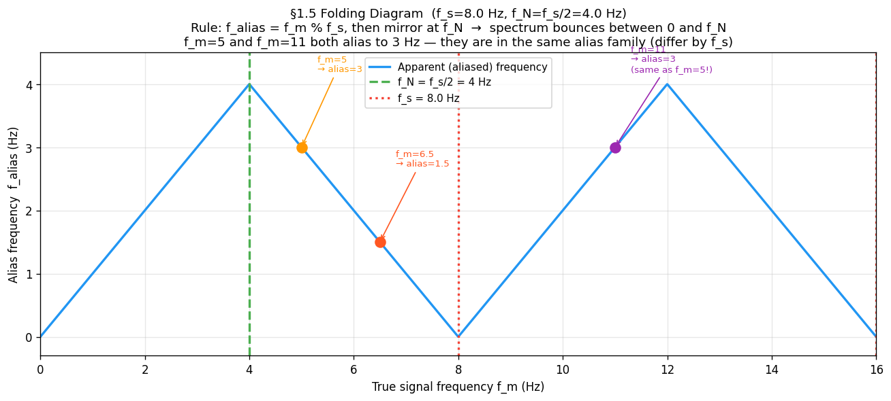

```python
fs_fold = 8.0
f_N     = fs_fold / 2.0
f_range = np.linspace(0, 2 * fs_fold, 2000)

def apparent_frequency(f_true, f_s):
    """Two-step folding: mod then mirror at Nyquist."""
    f_N   = f_s / 2.0
    f_mod = f_true % f_s
    return np.where(f_mod <= f_N, f_mod, f_s - f_mod)

f_apparent = apparent_frequency(f_range, fs_fold)

plt.figure(figsize=(11, 5))
plt.plot(f_range, f_apparent, lw=2, label='Apparent (aliased) frequency')
plt.axvline(f_N,    linestyle='--', label=f'f_N = {f_N} Hz')
plt.axvline(fs_fold, linestyle=':', label=f'f_s = {fs_fold} Hz')

# Mark the three examples — f_m=5 and f_m=11 land at the same alias
for f_ex, f_al, note in [(5.0, 3.0, 'f_m=5→3'), (6.5, 1.5, 'f_m=6.5→1.5'), (11.0, 3.0, 'f_m=11→3')]:
    plt.scatter([f_ex], [f_al], zorder=5, s=80)
    plt.annotate(note, xy=(f_ex, f_al), xytext=(f_ex + 0.3, f_al + 1.0),
                 arrowprops=dict(arrowstyle='->'))

plt.xlabel('True frequency f_m (Hz)')
plt.ylabel('Alias frequency (Hz)')
plt.title(f'Folding diagram (f_s={fs_fold} Hz) — spectrum bounces between 0 and f_N')
plt.legend()
plt.show()
```

---

## 1.7 Phase Offset — Why Exactly $f_s = 2f_m$ is Fragile — The Ideal Reconstructor

Given samples $x[n]$, the **Whittaker–Shannon formula** reconstructs the original signal:

$$x(t) = \sum_{n=-\infty}^{\infty} x[n] \cdot \text{sinc}\!\left(f_s \cdot (t - n/f_s)\right)$$

where $\text{sinc}(u) = \sin(\pi u)/(\pi u)$.

Each sample contributes a sinc "kernel" centred at its sample time. When $f_s \geq 2f_m$, these kernels cancel perfectly everywhere the signal has no energy — giving exact reconstruction.

When $f_s < 2f_m$, the reconstruction still runs — but it faithfully reconstructs the *alias*, not the true signal. The simulation makes this visible: a 5 Hz input emerges as 3 Hz output.

### Phase offset — why exactly $f_s = 2f_m$ is fragile

The theorem says $f_s = 2f_m$ is sufficient — in theory. In practice the sampler and signal have independent clocks, so a phase offset $\phi$ can occur. At exactly the Nyquist rate:

- $\phi = 0°$: samples land on peaks and troughs → amplitude correctly captured
- $\phi = 90°$: samples land on every zero-crossing → all samples = 0 → reconstruction is a flat line

This is not a rare edge case — any arbitrary phase relationship between signal and sampler produces some amplitude error. Real systems therefore **oversample** ($f_s \gg 2f_m$) to make phase offset negligible.

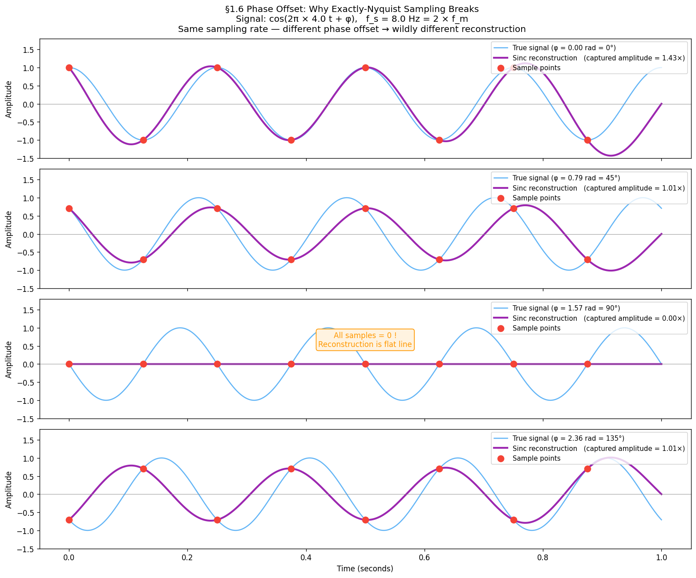

```python
f_phase  = 4.0
fs_exact = 2 * f_phase   # exactly at Nyquist = 8 Hz
t_ref    = np.linspace(0, 1, 3000)
phase_offsets = [0, np.pi / 4, np.pi / 2, 3 * np.pi / 4]

fig, axes = plt.subplots(4, 1, figsize=(13, 11), sharex=True)
for ax, phi in zip(axes, phase_offsets):
    true_sig = np.cos(2 * np.pi * f_phase * t_ref + phi)
    t_s      = np.arange(0, 1, 1.0 / fs_exact)
    s_s      = np.cos(2 * np.pi * f_phase * t_s + phi)
    recon    = sum(sn * np.sinc(fs_exact * (t_ref - tn)) for tn, sn in zip(t_s, s_s))

    captured_amplitude = np.max(np.abs(recon))
    ax.plot(t_ref, true_sig, alpha=0.6, label=f'True signal (φ={np.degrees(phi):.0f}°)')
    ax.plot(t_ref, recon, lw=2.5, label=f'Reconstruction  (amplitude={captured_amplitude:.3f})')
    ax.scatter(t_s, s_s, s=70, zorder=5)
    ax.legend(loc='upper right', fontsize=9); ax.set_ylabel('Amplitude')

axes[-1].set_xlabel('Time (s)')
plt.suptitle('Phase offset at exactly Nyquist rate — φ=90° collapses reconstruction to zero', fontsize=12)
plt.tight_layout()
plt.show()
```

---

## 1.8 From 1D to 2D — The Nyquist Square

An image is a 2D signal $I(x, y)$. The Nyquist criterion applies **independently along each axis**:

- Along $x$ (columns): need $f_{s,x} \geq 2 u_m$
- Along $y$ (rows): need $f_{s,y} \geq 2 v_m$

A 2D sinusoidal pattern has a **frequency vector** $(u, v)$ in cycles/pixel. The safe zone is the **Nyquist square** in 2D frequency space:

$$|u| \leq f_{N,x} \quad \text{AND} \quad |v| \leq f_{N,y}$$

Any $(u, v)$ outside this square aliases. The direction depends on which axis is violated:

| Violation | Artefact |
|-----------|----------|
| $u > f_{N,x}$ only | False horizontal stripes |
| $v > f_{N,y}$ only | False vertical stripes |
| Both violated | Moiré — diagonal phantom pattern |

A square sensor with $N \times N$ pixels has $f_N = N/2$ cycles per image. Any scene pattern with more than $N/2$ cycles across the image will alias.

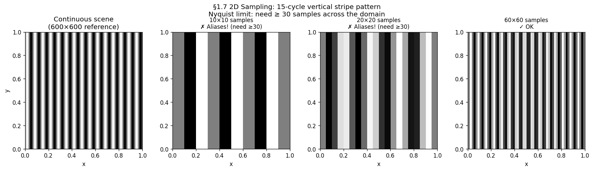

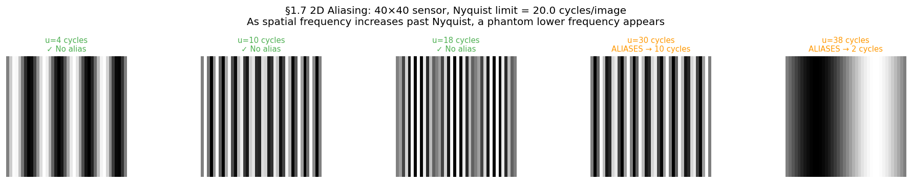

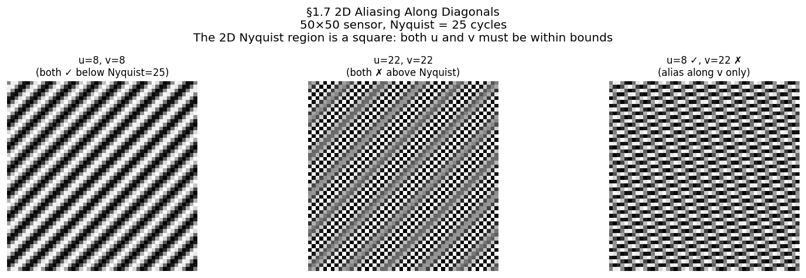

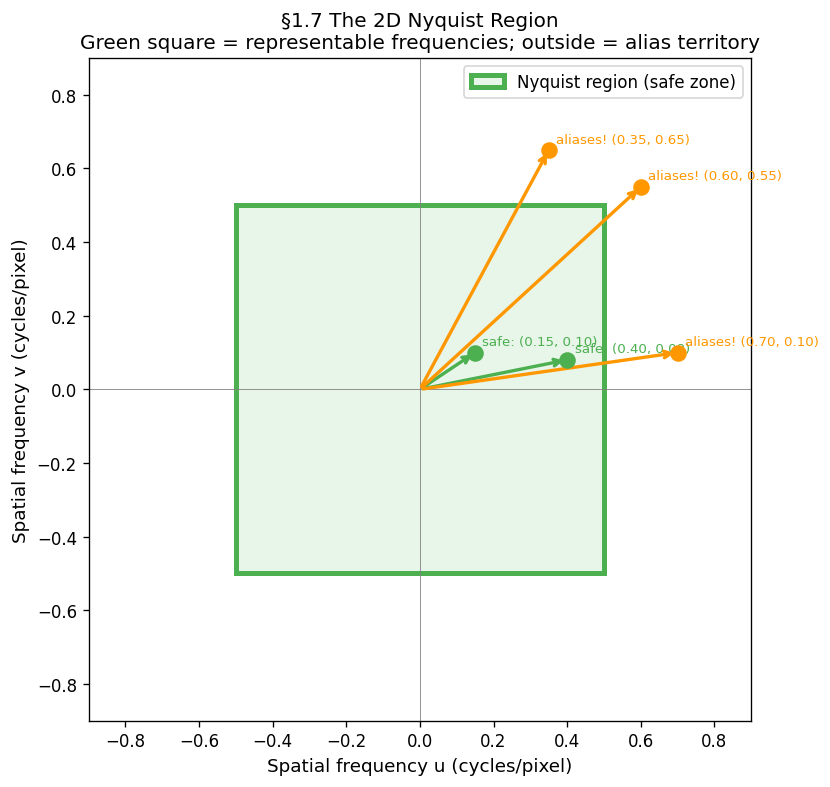

```python
# ── 2D stripe: same 15-cycle pattern at three sensor resolutions ──────────
u_pattern = 15   # cycles across the unit square
HIGH_RES  = 600
x_c = np.linspace(0, 1, HIGH_RES)
XX_c, _ = np.meshgrid(x_c, x_c)
continuous_2d = np.sin(2 * np.pi * u_pattern * XX_c)

fig, axes = plt.subplots(1, 4, figsize=(15, 4))
axes[0].imshow(continuous_2d, cmap='gray'); axes[0].set_title('Continuous scene')
for ax, N in zip(axes[1:], [10, 20, 60]):
    x_s = np.linspace(0, 1, N)
    XX_s, _ = np.meshgrid(x_s, x_s)
    sampled = np.sin(2 * np.pi * u_pattern * XX_s)
    status = '✓ OK' if N >= 2 * u_pattern else '✗ Aliases!'
    ax.imshow(sampled, cmap='gray', interpolation='nearest')
    ax.set_title(f'{N}×{N} — {status}')
plt.show()

# ── 2D aliasing sweep: fix sensor at 40×40, vary pattern frequency ────────
SENSOR_N = 40
x_s = np.linspace(0, 1, SENSOR_N)
XX_s, _ = np.meshgrid(x_s, x_s)
fig, axes = plt.subplots(1, 5, figsize=(16, 3))
for ax, u in zip(axes, [4, 10, 18, 30, 38]):
    ax.imshow(np.sin(2 * np.pi * u * XX_s), cmap='gray', interpolation='nearest')
    ax.set_title(f'u={u} {"✓" if u <= SENSOR_N//2 else "✗ alias"}', fontsize=9)
    ax.axis('off')
plt.show()

# ── Diagonal aliasing ─────────────────────────────────────────────────────
SENSOR_D = 50
x_d = np.linspace(0, 1, SENSOR_D)
XX_d, YY_d = np.meshgrid(x_d, x_d)
cases = [(8, 8, 'u=8,v=8 ✓'), (22, 22, 'u=22,v=22 ✗'), (8, 22, 'u=8✓ v=22✗')]
fig, axes = plt.subplots(1, 3, figsize=(13, 4))
for ax, (u, v, title) in zip(axes, cases):
    ax.imshow(np.sin(2 * np.pi * (u * XX_d + v * YY_d)), cmap='gray', interpolation='nearest')
    ax.set_title(title); ax.axis('off')
plt.show()

# ── Nyquist square diagram ────────────────────────────────────────────────
f_N_2d = 0.5
fig, ax = plt.subplots(figsize=(6, 6))
ax.add_patch(plt.Rectangle((-f_N_2d, -f_N_2d), 2*f_N_2d, 2*f_N_2d,
             linewidth=3, edgecolor='green', facecolor='#E8F5E9', label='Nyquist region'))
for u, v, safe, label in [(0.15, 0.10, True, 'safe'), (0.70, 0.10, False, 'aliases!'),
                           (0.35, 0.65, False, 'aliases!')]:
    color = 'green' if safe else 'orange'
    ax.annotate('', xy=(u, v), xytext=(0, 0), arrowprops=dict(arrowstyle='->', color=color, lw=2))
    ax.text(u+0.02, v+0.02, label, fontsize=9, color=color)
ax.set(xlim=(-0.9, 0.9), ylim=(-0.9, 0.9), aspect='equal',
       xlabel='u (cycles/pixel)', ylabel='v (cycles/pixel)',
       title='2D Nyquist region — green square is the safe zone')
ax.legend()
plt.show()
```

---

## 1.9 Moiré — 2D Aliasing in Practice

Moiré is what aliasing looks like in a photograph. When a fine periodic texture — fabric weave, window mesh, brick mortar, PCB traces — is photographed at insufficient resolution, its high spatial frequency aliases to a coarser phantom pattern. The phantom is not in the scene; it is created by the sampling process.

**Construction:**
- True scene: $\sin(2\pi f_m x)$ where $f_m > f_N$
- After sampling at $f_s$: samples identical to $\sin(2\pi (f_s - f_m) x)$
- Reconstructed image shows $f_s - f_m$ cycles — a slower, longer-wavelength pattern

**Prevention:** apply a **low-pass filter** (optical or digital) *before* sampling, removing all content above $f_N$. Camera manufacturers place an **Optical Low-Pass Filter (OLPF)** directly in front of the sensor array. In software, this is a Gaussian or Lanczos blur before any downsampling operation.

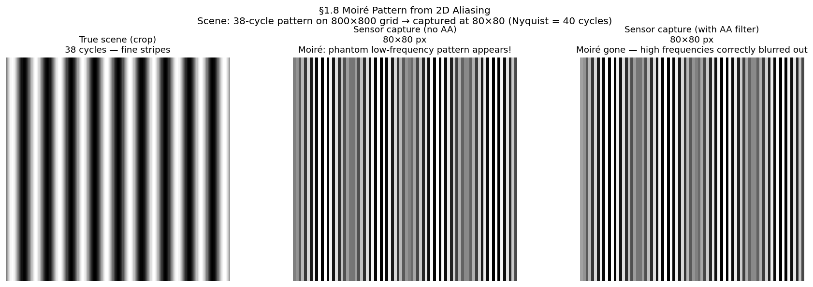

```python
from scipy.ndimage import gaussian_filter

SCENE_SIZE  = 800
SENSOR_SIZE = 80
f_high      = 38    # above Nyquist (= 40)

x_scene = np.linspace(0, 1, SCENE_SIZE)
XX_scene, _ = np.meshgrid(x_scene, x_scene)
scene_pattern = np.sin(2 * np.pi * f_high * XX_scene)

step = SCENE_SIZE // SENSOR_SIZE
# Without AA — naive downsample, alias appears
aliased_image = scene_pattern[::step, ::step]

# With AA — Gaussian blur before downsample removes content above Nyquist
sigma = step / (2 * np.pi)
antialiased_img = gaussian_filter(scene_pattern, sigma=sigma)[::step, ::step]

fig, axes = plt.subplots(1, 3, figsize=(15, 5))
axes[0].imshow(scene_pattern[:200, :200], cmap='gray'); axes[0].set_title('True scene (crop)')
axes[1].imshow(aliased_image, cmap='gray'); axes[1].set_title('No AA filter — moiré appears!')
axes[2].imshow(antialiased_img, cmap='gray'); axes[2].set_title('With AA filter — moiré gone')
for ax in axes: ax.axis('off')
plt.show()
```

> **Run all simulations:** `uv run python tutorials/00_introduction_to_digital_images/part1_digitisation.py`
> Figures save to `book/figures/`.

---

## Summary

| Concept | Statement |
|---------|-----------|
| Sampling | Measuring a continuous signal at $t = n/f_s$ |
| $f_m$ | Highest frequency in the signal |
| $f_N = f_s/2$ | Nyquist frequency — ceiling set by your hardware |
| Nyquist rate | Minimum $f_s = 2f_m$ for lossless reconstruction |
| Alias family | $\{f_m + kf_s \mid k \in \mathbb{Z}\}$ — all produce identical samples |
| Folding | Frequencies above $f_N$ mirror back into $[0, f_N]$ |
| Sinc reconstruction | Exact when $f_s \geq 2f_m$; outputs alias otherwise |
| Phase fragility | At exactly $f_s = 2f_m$, a $90°$ offset destroys the signal |
| 2D Nyquist | Applies per axis; violation → moiré |
| Prevention | Low-pass filter before sampling (OLPF / Gaussian blur) |

---

## Exercises

1. $f_s = 12$ Hz. List the first three alias family members of $f_m = 3$ Hz.
2. A sensor has 640 pixels across a 100 mm field. What is $f_N$ in cycles/mm? What is the smallest detectable feature?
3. Why does the moiré pattern in a photograph of a fine mesh *move* when you zoom the image in a browser?

---

**Next →** [Chapter 2 — The Sensor](../ch02_sensor/ch02_sensor.md): now that we know *what* sampling means, what does the hardware physically do at each sample point?
