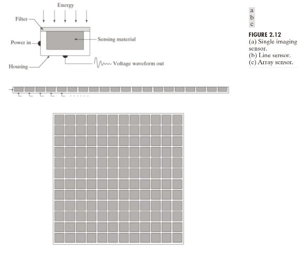
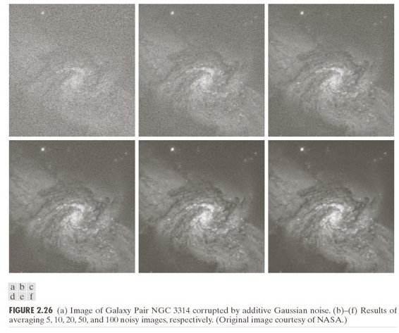

# Chapter 2 — The Sensor
### From Photons to Electron Counts

> *Chapter 1 established what sampling means mathematically. This chapter asks: what does the hardware physically do at each sample point? The answer involves photons, quantum mechanics, and irreducible randomness.*

---

## 2.1 The Photosite

A camera sensor is a grid of **photosites** — tiny light-sensitive elements, one per pixel. Each photosite executes the sampling operation from Chapter 1 at its spatial location. During the exposure time it:

1. **Collects photons** arriving from the focused scene
2. **Converts photons to electrons** via the photoelectric effect (one photon → at most one electron)
3. **Accumulates electrons** in a potential well until readout
4. **Reads out the charge** as a voltage, then converts it to a digital integer via an ADC

The integer that emerges is the pixel value. It is a count of electrons — a proxy for the number of photons that arrived, which is itself a proxy for scene brightness.

---

## 2.2 Photon Counting Is Inherently Random

Photon arrivals are a **Poisson process**: independent random events occurring at some average rate $\lambda$ (photons per second per photosite area). Even if the scene is perfectly uniform and the sensor is perfect, the count in any one exposure is random.

For a Poisson process with mean $\lambda$:

$$\sigma^2 = \lambda \quad \Rightarrow \quad \sigma = \sqrt{\lambda}$$

The standard deviation equals the square root of the mean. This is **shot noise** — not an instrument defect, but a fundamental consequence of the discrete nature of light.

**Implication:** even a perfectly flat, perfectly lit, perfectly uniform scene produces pixel values that vary from photosite to photosite. The variation scales as $\sqrt{\lambda}$.

---

## 2.3 Signal-to-Noise Ratio

Signal is the mean electron count $S$. Noise has two contributions:

- **Shot noise:** $\sigma_{shot} = \sqrt{S}$ — from photon statistics
- **Read noise:** $\sigma_r$ — from the amplifier and ADC circuitry

Total noise in quadrature:

$$\text{SNR} = \frac{S}{\sqrt{S + \sigma_r^2}}$$

At high signal ($S \gg \sigma_r^2$) this simplifies to:

$$\text{SNR} \approx \sqrt{S}$$

**Doubling the signal improves SNR by $\sqrt{2} \approx 41\%$.**

---

## 2.4 Key Sensor Parameters

| Parameter | Symbol | Typical phone | Typical DSLR | Effect |
|-----------|--------|--------------|-------------|--------|
| Photosite area | $A$ | ~1 µm² | ~25 µm² | Larger → more photons → higher SNR |
| Full-well capacity | $C$ | ~1,000 e⁻ | ~50,000 e⁻ | Maximum before saturation |
| Read noise | $\sigma_r$ | ~3 e⁻ | ~5 e⁻ | Noise floor |
| Quantum efficiency | QE | 0.4–0.6 | 0.5–0.8 | Fraction of photons → electrons |

Mean electron signal: $S = \phi \cdot A \cdot \text{QE} \cdot t_{exp}$ where $\phi$ is photon flux and $t_{exp}$ is exposure time.

---

## 2.5 Phone vs DSLR — Why Sensor Size Matters

A DSLR photosite is roughly 25× larger than a phone photosite. Same scene, same exposure time → DSLR collects 25× more photons → $\text{SNR}_{DSLR} \approx 5\times \text{SNR}_{phone}$.

This is not about optics quality or processing — it is pure geometry. A larger bucket catches more rain.

| Condition | Phone | DSLR |
|-----------|-------|------|
| Bright daylight | Good | Good |
| Indoor | Noisy | Acceptable |
| Night | Very noisy (SNR ≈ 1) | Usable |

**Critical consequence for computer vision:** pixel values from a phone and a DSLR of the *same scene* are **not numerically comparable**, even at the same exposure settings. The pixel value encodes sensor physics, not just scene brightness.

---

## 2.6 The Pixel Value Equation

$$\text{pixel value} = f\!\left(\phi \cdot A \cdot \text{QE} \cdot t_{exp} + \sigma_r + \sigma_{dark}\right)$$

where $f$ is the ADC mapping and $\sigma_{dark}$ is dark current noise. Every term except $\phi$ (photon flux from the scene) is a camera-specific nuisance. Two cameras imaging the same scene produce different pixel values — not because the scene differs, but because their hardware parameters differ.

This is the root of the problem explored in Chapter 6.

> **Run:** `uv run python tutorials/00_introduction_to_digital_images/part2_sensor_physics.py` to generate SNR vs brightness curves and the shot noise simulation.

---

## Summary

| Concept | Key fact |
|---------|----------|
| Photosite | Converts photons to electrons; one per pixel |
| Shot noise | $\sigma = \sqrt{S}$ — irreducible, from photon statistics |
| SNR | $\approx \sqrt{S}$ at high signal; bigger photosite = higher SNR |
| Full-well capacity | Max electrons before saturation = white clipping |
| Pixel value | Encodes scene brightness + sensor physics + noise |

---

**Next →** [Chapter 3 — Pixels](../ch03_pixels/README.md): the sensor produces a grid of integers — what does that grid mean, and what are its limits?
