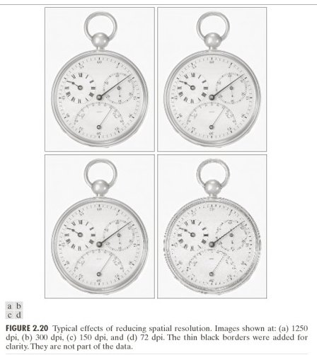
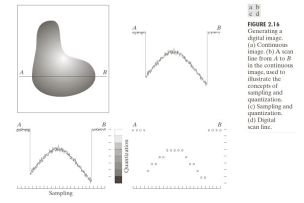
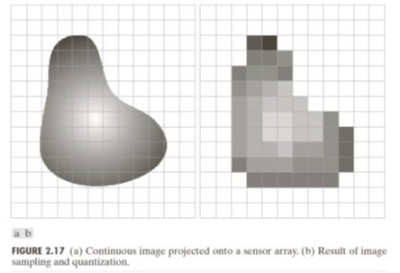
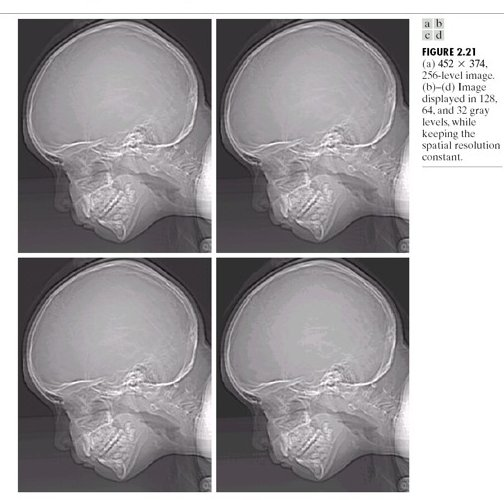

# Chapter 3 — Pixels
### What the Grid of Numbers Actually Means

> *Chapter 2 explained how the sensor produces one integer per photosite. This chapter asks: what is that integer, what are its limits, and what happens when you try to represent too much with too few?*

---

## 3.1 What a Pixel Is — and Is Not

A pixel is a **single number**: the average brightness measured by one photosite at one grid location. It has:

- A **position** $(i, j)$ in the 2D array ($i$ = row, $j$ = column)
- A **value** — a non-negative integer representing brightness
- **No internal structure** — it is just a number, not a tiny photograph

When a screen renders an image it draws each pixel as a coloured square. That is a display convention, not a property of the data. The underlying data is a 2D array of integers.

**Common misconception:** zooming into a digital image reveals more detail. It does not — it only makes the squares bigger. All the detail that exists was fixed at capture time by the sensor's spatial sampling rate (Chapter 1).

---

## 3.2 Spatial Resolution

**Spatial resolution** = the number of pixels: width × height. More pixels means finer spatial sampling, which preserves more scene detail.

But pixels alone say nothing about real-world scale. The same 1000×1000 pixel image could represent a postage stamp or a football field. What matters for computer vision is the **ground sampling distance (GSD)**:

$$\text{GSD} = \frac{\text{physical scene width (mm)}}{\text{image width (pixels)}}$$

GSD is the real-world size each pixel represents. It determines the smallest detectable feature:

$$\text{minimum detectable feature} \geq 2 \times \text{GSD}$$

(The factor of 2 is the Nyquist criterion from Chapter 1, applied to spatial resolution.)

**Industrial inspection example:**

| Setup | GSD | Bolt (20 mm) | Scratch (2 mm) |
|-------|-----|-------------|----------------|
| 5×5 pixel grid | 20 mm/px | 1 pixel | sub-pixel — invisible |
| 25×25 pixel grid | 4 mm/px | 5 pixels | 0.5 pixel — barely detectable |
| 100×100 pixel grid | 1 mm/px | 20 pixels | 2 pixels — detectable |

---

## 3.3 Quantization

After the sensor measures a voltage proportional to electron count, the **ADC** maps it to a discrete integer. This mapping — rounding a continuous value to the nearest level — is **quantization**.

For $B$-bit depth, there are $2^B$ levels. The step size between adjacent levels is:

$$\Delta = \frac{V_{\max}}{2^B - 1}$$

The quantization error is at most $\pm \Delta/2$.

| Bit depth | Levels | Max error | Usage |
|-----------|--------|-----------|-------|
| 8-bit | 256 | 0.5 intensity units | JPEG, display |
| 12-bit | 4096 | ~0.06 intensity units | Camera RAW |
| 16-bit | 65536 | ~0.008 intensity units | Scientific imaging |

Quantization error is **deterministic and irreversible** — unlike shot noise (random), it cannot be averaged away. Once the ADC rounds a value, the fractional part is gone.

---

## 3.4 False Contours

When bit depth is too low, smooth gradients in the scene produce **false contours** — visible step edges where the true scene varies smoothly.

A 2-bit image has only 4 grey levels (0, 85, 170, 255). A smooth gradient from 0 to 255 jumps in steps of 85 intensity units. Each step is visible as a hard edge — a feature that doesn't exist in the scene.

False contours are the spatial equivalent of quantization noise. They disappear when bit depth is increased to 8-bit or beyond.

---

## 3.5 Two Sources of Error — So Far

| Source | Type | Scales with | Controllable? |
|--------|------|-------------|---------------|
| Shot noise (Ch 2) | Random | $\sqrt{S}$ | Partially — more light helps |
| Quantization error (Ch 3) | Deterministic | $\Delta/2$ | Yes — more bits eliminates it |

Both corrupt pixel values independently of scene content. We have not yet accounted for contrast changes, shading, colour processing, or compression — those come in Chapters 4–5 and dominate the problem in Chapter 6.

> **Run:** `uv run python tutorials/00_introduction_to_digital_images/part3_pixels_and_resolution.py` to generate the GSD and bit-depth simulations.

---

## Summary

| Concept | Key fact |
|---------|----------|
| Pixel | Single integer = average brightness at $(i,j)$; no internal structure |
| Resolution | Width × height; more pixels = finer spatial sampling |
| GSD | Physical size per pixel; sets the smallest detectable feature |
| Nyquist (spatial) | Minimum 2 pixels per feature period to avoid aliasing |
| Quantization | Rounding to $2^B$ levels; error ≤ $\Delta/2$; irreversible |
| False contours | Visible step edges from coarse quantization on smooth gradients |

---

**Next →** [Chapter 4 — Contrast and Dynamic Range](../ch04_contrast/README.md): we have integer pixel values — what do those values *mean*, and what happens when the scene's brightness range exceeds what the sensor can record?
