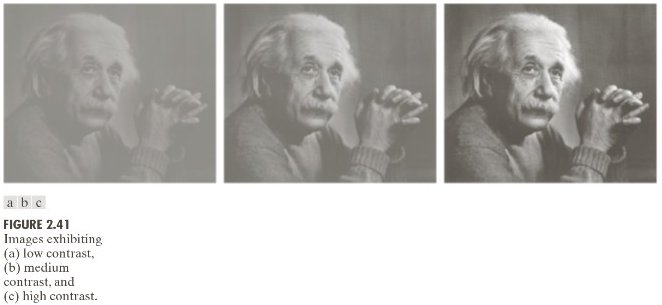
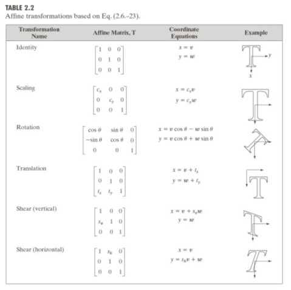

# Chapter 4 — Contrast and Dynamic Range
### What Pixel Values Mean

> *You now have a grid of integers. This chapter asks what those integers represent — and reveals the first major reason they cannot be trusted as direct measurements of scene content.*

---

## 4.1 Contrast — The Spread of Pixel Values

**Contrast** is how far apart the dark and bright pixels are. A high-contrast image uses the full 0–255 range. A low-contrast image clusters all its values in a narrow band.

Two quantitative definitions:

**Michelson contrast** (useful for periodic patterns):
$$C = \frac{I_{\max} - I_{\min}}{I_{\max} + I_{\min}}$$

**Standard deviation contrast** (useful for natural images):
$$C_\sigma = \text{std}(I)$$

Both measure the same thing: how much the pixel values vary.

**The problem:** two images of the same scene at different contrast levels have different pixel values for every pixel — even though the content is identical. Pixel-level comparison treats them as different images.

---

## 4.2 The Affine Model

When the same scene is photographed under different lighting, the pixel values are related by an **affine transformation**:

$$I_2(i,j) = a \cdot I_1(i,j) + b$$

- $a$ scales all values: changes **contrast**
- $b$ shifts all values: changes **brightness**

This is not an approximation — it follows directly from the linear relationship between photon flux and electron count in the sensor (Chapter 2). Different exposure time, different aperture, or different ambient light all change $a$ and $b$.

**Consequence:** the same face photographed in morning light and afternoon light produces pixel values that differ by $aI + b$ at every location. A naive pixel comparator sees two different faces.

### The Einstein example

The Gonzalez & Woods textbook shows the same portrait at three contrast levels. The pixel values differ by up to 100 grey levels between the low and high contrast versions — despite showing the same content.

> **Run:** `uv run python tutorials/00_introduction_to_digital_images/part4_contrast_and_dynamic_range.py` to generate the histogram comparisons.

---

## 4.3 Dynamic Range

**Dynamic range** is the ratio between the brightest and darkest values the sensor can capture simultaneously:

$$\text{DR} = 20 \log_{10}\!\left(\frac{I_{\max}}{I_{\min}}\right) \quad \text{(dB)}$$

| System | Dynamic range |
|--------|--------------|
| Human eye (adapted) | ~21 stops (126 dB) |
| Modern DSLR | ~14 stops (84 dB) |
| Phone camera | ~10–12 stops |
| 8-bit stored image | ~48 dB |

Real-world scenes routinely exceed sensor dynamic range. A window in a dark room spans 20+ stops — more than any camera can capture in a single exposure. The sensor must clip one end.

---

## 4.4 Clipping — Permanent Information Loss

When scene brightness exceeds the sensor's range, pixel values are **clipped**:

- **Highlight clipping:** pixels at the bright end saturate to 255. All detail in bright regions is permanently lost — white blobs.
- **Shadow clipping:** pixels at the dark end round to 0. Detail in dark regions is lost — black blobs.

Clipping is irreversible. Unlike shot noise (which can be partially reduced by averaging) or quantization (which can be reduced by more bits), clipped values carry no information about the original brightness — the ADC has discarded it.

The implication for contrast stretching (a common pre-processing step): stretching a clipped image amplifies the clipping artefact. The white blob becomes a bigger white blob.

---

## Summary

| Concept | Key fact |
|---------|----------|
| Contrast | Spread of pixel values; same scene → different values at different contrast |
| Affine model | $I_2 = aI_1 + b$; illumination change → affine pixel change |
| Dynamic range | Ratio of max/min capturable brightness |
| Clipping | Values outside DR are saturated; information permanently lost |

The affine model $I_2 = aI_1 + b$ is the central obstacle of Chapters 6–7. Fixing it requires normalisation — but normalisation has a ceiling, which Part II explores.

---

**Next →** [Chapter 5 — Colour and the Imaging Pipeline](../ch05_colour/README.md): so far we have treated images as grayscale. Real cameras capture colour — adding three more dimensions of variability to the pixel value problem.
