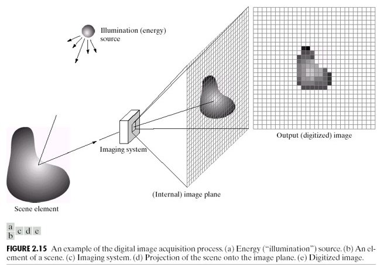

# Chapter 5 — Colour and the Imaging Pipeline
### From Scene Light to Stored File

> *Every concept from Chapters 1–4 applied independently to each colour channel. This chapter adds colour, traces the full pipeline from photon to JPEG, and counts every transformation that corrupts the pixel value along the way.*

---

## 5.1 From Grayscale to Colour

A grayscale image has one value per pixel. A colour image has three — one per channel:

```
Grayscale:  I[i, j]          — 2D array, shape (H, W)
Colour:     I[i, j, c]       — 3D array, shape (H, W, 3),  c ∈ {R, G, B}
```

Each channel is an independent grayscale image. The perceived colour comes from the ratio of R, G, B intensities at each pixel.

All physics from Chapters 1–4 applies to each channel independently:
- Shot noise is Poisson per channel
- Quantization error exists per channel
- The affine model $I_2 = aI_1 + b$ applies per channel (with different $a, b$ per channel)
- Aliasing occurs independently along rows and columns in each channel

---

## 5.2 The Bayer Filter — How Sensors Capture Colour

Camera sensors are physically **monochrome**. To capture colour, a **Bayer colour filter array (CFA)** is placed over the photosites:

```
R  G  R  G  R  G
G  B  G  B  G  B
R  G  R  G  R  G
G  B  G  B  G  B
```

Each photosite records only one channel. The pattern has 2× more green photosites than red or blue — matching the human visual system's higher sensitivity to green.

The missing two channels at each pixel are **interpolated** from neighbouring photosites. This is **demosaicing** — itself a form of reconstruction, and itself subject to error at sharp edges (colour fringing).

---

## 5.3 Luminance — Converting to Grayscale Correctly

When colour is not needed, converting to grayscale with a **perceptual luminance** formula preserves the appearance of brightness:

$$L = 0.2126 \cdot R + 0.7152 \cdot G + 0.0722 \cdot B$$

This is the ITU-R BT.709 standard. The large green coefficient reflects the eye's sensitivity peak. Simple averaging ($L = (R+G+B)/3$) gives wrong perceptual brightness — a fully saturated red looks darker than it should.

For most shape, texture, and edge detection tasks, luminance is all you need. Colour adds value when distinguishing objects that differ in hue but not brightness.

---

## 5.4 The Full Imaging Pipeline

Every digital image passes through this chain from scene to stored file:

```
Scene (continuous light)
  │
  ▼  [Lens] — focuses light onto sensor plane
Photosites (spatial sampling at grid Δx × Δy)
  │  + Shot noise added (Poisson, per photosite)
  │  + Dark current accumulates
  ▼
Bayer filter (one channel recorded per photosite)
  │
  ▼  [ADC] — voltage → integer  (quantization)
Raw image (one channel per photosite, 12–16 bit)
  │
  ▼  [ISP] — demosaicing, white balance, tone mapping, sharpening
RGB image (3 channels, 8–16 bit)
  │
  ▼  [Codec] — JPEG/PNG compression
Stored image (uint8, 3 channels)
```

**Every arrow is a transformation that changes pixel values without changing the scene.** The final stored pixel value reflects:

1. Scene content — the signal we want
2. Lighting conditions ($a$ and $b$ in the affine model)
3. Sensor noise (shot, read, dark current)
4. ADC quantization
5. Demosaicing interpolation
6. ISP choices (white balance, tone curve, sharpening)
7. Compression artefacts

Items 2–7 are nuisances for any pixel-comparison algorithm.

---

## 5.5 Shading — When the Sensor Responds Non-Uniformly

Even with perfectly uniform scene illumination, pixel values vary across the image if the **sensor has spatially non-uniform gain** — called shading or vignetting.

The model:

$$I(i,j) = T(i,j) \cdot S(i,j)$$

where $T$ is true reflectance and $S$ is the spatially varying shading field ($S < 1$ near edges for vignetting).

This breaks the global affine model: $a$ and $b$ are no longer constants — they vary with position. A template extracted from the image centre will not match the same material at the edges, even if the material is identical.

---

## 5.6 The Complete Error Stack

Collecting all effects across Chapters 1–5:

| Effect | Chapter | Mechanism | Changes pixel values without changing scene? |
|--------|---------|-----------|----------------------------------------------|
| Aliasing | 1 | Undersampling → phantom frequencies | Yes |
| Shot noise | 2 | Poisson photon counting | Yes — random |
| Read noise | 2 | Amplifier/ADC electronics | Yes — random |
| Quantization | 3 | ADC rounding | Yes — deterministic |
| Contrast change | 4 | Global $a$ change | Yes |
| Brightness change | 4 | Global $b$ change | Yes |
| Dynamic range clipping | 4 | Saturation | Yes — irreversible |
| Demosaicing error | 5 | CFA interpolation | Yes — at edges |
| White balance | 5 | Per-channel scaling | Yes |
| Shading | 5 | Spatially varying gain | Yes — position-dependent |
| JPEG compression | 5 | DCT quantization | Yes |

Every row in this table is a reason to distrust raw pixel values as direct measurements of scene content. Part II builds the case formally and develops the normalisation tools that address as many of these as possible.



> **Run:** `uv run python tutorials/00_introduction_to_digital_images/part6_colour_and_pipeline.py` to generate RGB channel decomposition and shading artefact figures.

---

## Summary

| Concept | Key fact |
|---------|----------|
| Colour image | 3D array (H, W, 3); each channel obeys same physics as grayscale |
| Bayer CFA | One channel per photosite; other two interpolated (demosaicing) |
| Luminance | $L = 0.2126R + 0.7152G + 0.0722B$ — perceptual brightness |
| Pipeline | 7+ transformations from photon to stored pixel; each one a nuisance |
| Shading | Spatially varying gain; breaks global affine model |
| Error stack | 11 effects that change pixel values without changing scene content |

---

**Next →** [Chapter 6 — The Problem with Raw Pixels](../../part3_why_raw_signals_fail/ch06_pixel_problems/README.md): now that we understand the full error stack, Part III builds the systematic case for why raw pixel comparison fails and what can be done about it.
