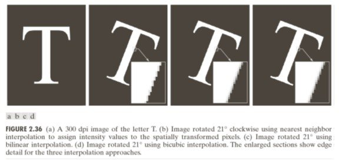

# Chapter 6 — The Problem with Raw Pixels
### Why Direct Pixel Comparison Fails — and Where Normalisation Hits Its Ceiling

> *Part I built a complete picture of everything that corrupts a pixel value. Part II asks: given that corruption, can we still compare images reliably? The answer is: sometimes yes, sometimes no — and the boundary between those two cases is the most important concept in classical computer vision.*

---

## 6.1 The Experiment

Pixel comparison means: given a reference patch $T$ and a query image $I$, find the location in $I$ that best matches $T$.

The simplest metric is **Sum of Squared Differences (SSD)**:

$$\text{SSD}(T, I_p) = \sum_{i,j} (T(i,j) - I_p(i,j))^2$$

where $I_p$ is the patch at position $p$. A perfect match gives SSD = 0.

Test it under three real-world transforms:

| Transform | Real-world cause | What changes |
|-----------|-----------------|--------------|
| Brightness ×0.7 | Lighting change, cloud cover | All pixel values scale |
| Rotation 5° | Camera tilt, part misalignment | Pixel grid shifts |
| Scale 90% | Different camera distance | Object size in pixels |

SSD fails on all three. The question is: which failures are fixable by math, and which are not?

---

## 6.2 Fixable: The Affine Lighting Model

From Chapter 4, different lighting produces $I_2 = aI_1 + b$. This is a **mathematical relationship between pixel values** — the pixels are still in the same positions, just with different values. Math can compensate.

### Step 1 — L2 normalisation (handle contrast, $a$)

Divide each patch by its L2 norm:

$$\hat{T} = \frac{T}{\|T\|}, \quad \hat{I}_p = \frac{I_p}{\|I_p\|}$$

If $I_2 = aI_1$, then $\hat{I}_2 = \hat{I}_1$ — the scale factor $a$ cancels. Contrast changes are removed.

### Step 2 — Mean subtraction (handle brightness offset, $b$)

Subtract the patch mean before normalising:

$$\tilde{T} = T - \bar{T}, \quad \tilde{I}_p = I_p - \bar{I}_p$$

If $I_2 = I_1 + b$, then $\tilde{I}_2 = \tilde{I}_1$ — the offset $b$ cancels. Brightness changes are removed.

### Step 3 — Pearson correlation (handle full affine $aI + b$)

Combine both: subtract mean, then normalise. The result is the **Pearson correlation coefficient**, which equals OpenCV's `TM_CCOEFF_NORMED`:

$$r = \frac{\sum_{i,j}(T - \bar{T})(I_p - \bar{I}_p)}{\sqrt{\sum(T-\bar{T})^2 \cdot \sum(I_p-\bar{I}_p)^2}}$$

$r = 1$ for a perfect match under any $aI + b$ transform. This is the best pixel-level comparator possible under the affine lighting model.

---

## 6.3 The Normalisation Ceiling

Pearson correlation handles $I_2 = aI_1 + b$ perfectly. But the real world produces transforms that move **which pixel is where**:

| Transform | What breaks | Fixable by normalisation? |
|-----------|-------------|--------------------------|
| Brightness change ($b$) | Pixel values | ✓ Yes — mean subtraction |
| Contrast change ($a$) | Pixel values | ✓ Yes — L2 normalisation |
| Rotation | Pixel positions | ✗ No |
| Scale | Pixel positions | ✗ No |
| Viewpoint change | Pixel positions | ✗ No |
| Occlusion | Some pixels missing | ✗ No |

Normalisation operates on pixel values at fixed positions. Once the grid shifts — due to rotation, scale, or viewpoint — there is no per-pixel math that can compensate. You need something that is invariant to spatial transforms, not just intensity transforms.

This is the **normalisation ceiling**.

---

## 6.4 What Lies Beyond the Ceiling

The normalisation ceiling is where classical template matching ends and feature-based methods begin.

**Hand-crafted features** (SIFT, HOG): describe local structure in a way that is explicitly invariant to rotation and scale — by design.

**Learned features** (CNNs): learn to extract representations that are invariant to whatever transforms appear in the training data — by optimisation.

Both approaches abandon the pixel value as the fundamental unit of comparison. Instead they compute a **descriptor** — a vector of derived quantities that encodes *what* is at a location, not *what numerical value* the pixel happens to have.

This transition — from pixels to features — is the subject of Parts IV and V.

> **Run:** `uv run python tutorials/02_why_not_pixels/` to run all 7 parts covering pixel failure → normalisation → Pearson correlation → ceiling → feature motivation.

---

## Summary

| Concept | Key fact |
|---------|----------|
| SSD | Fails under any illumination or spatial change |
| L2 normalisation | Removes contrast ($a$) |
| Mean subtraction | Removes brightness offset ($b$) |
| Pearson / `TM_CCOEFF_NORMED` | Full affine invariance — the best pixel-level comparator |
| Normalisation ceiling | Rotation, scale, viewpoint cannot be fixed by per-pixel math |
| Beyond the ceiling | Features — hand-crafted (SIFT) or learned (CNNs) |

---

**Next →** [Chapter 9 — Convolutions and Filtering](../../part5_learning_from_signals/ch09_convolutions/ch09_convolutions.md): Part IV begins — moving from comparing patches to learning features that are invariant to spatial transforms.

> **Want the math first?** Two applied capstones in Part I deepen the
> material from Chapters 2 and 6:
> - [`probability/applied_sensors.md`](../../../math/probability/applied_sensors.md) —
>   derives the sensor noise model from Bernoulli → Binomial → Poisson → Normal → CLT.
> - [`linear_algebra/applied_images.md`](../../../math/linear_algebra/applied_images.md) —
>   the geometry behind L2 normalisation, mean subtraction, and Pearson correlation.
